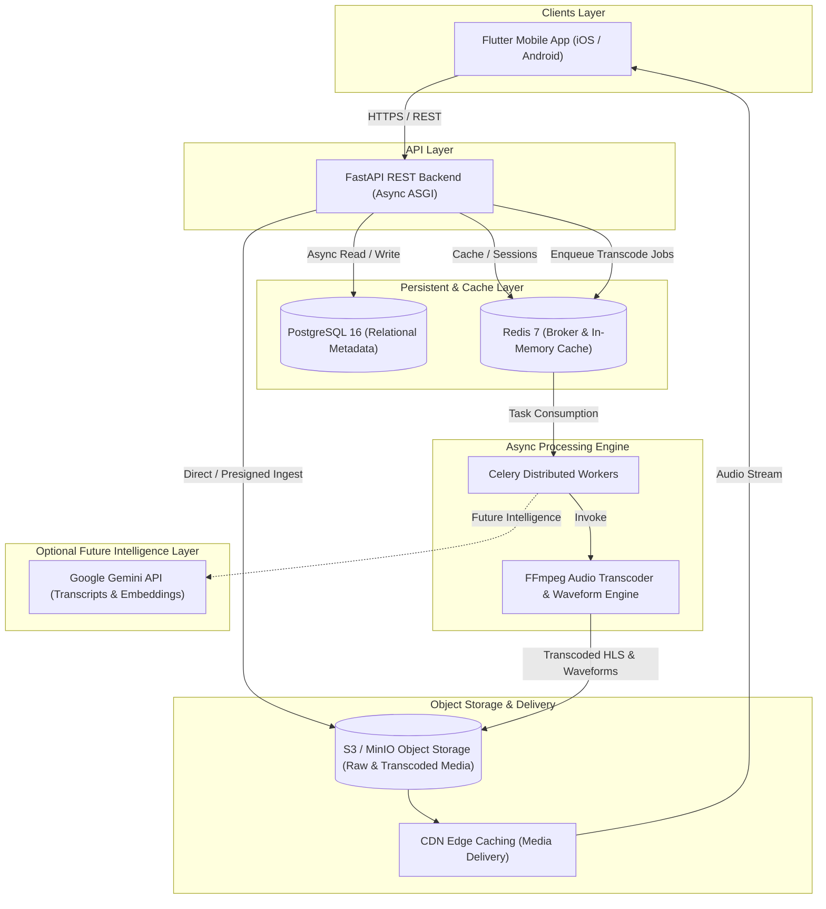
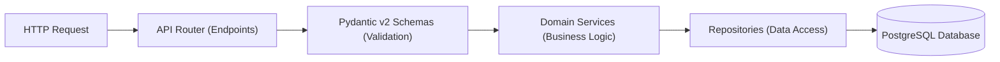
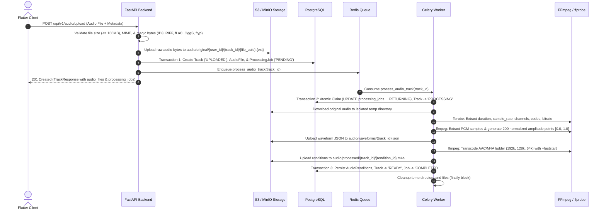
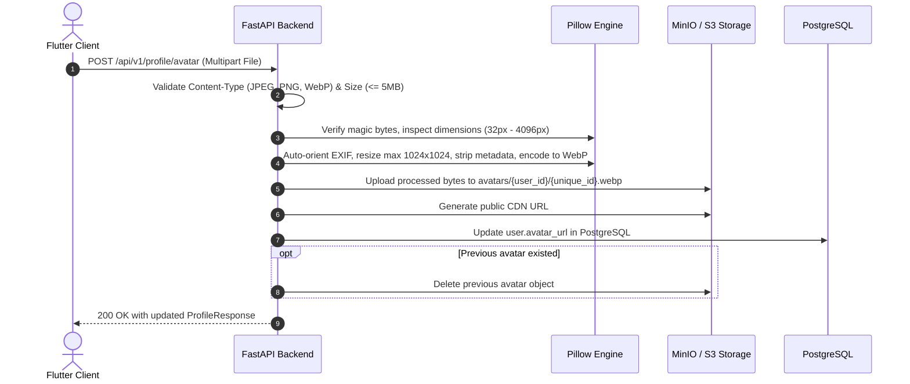
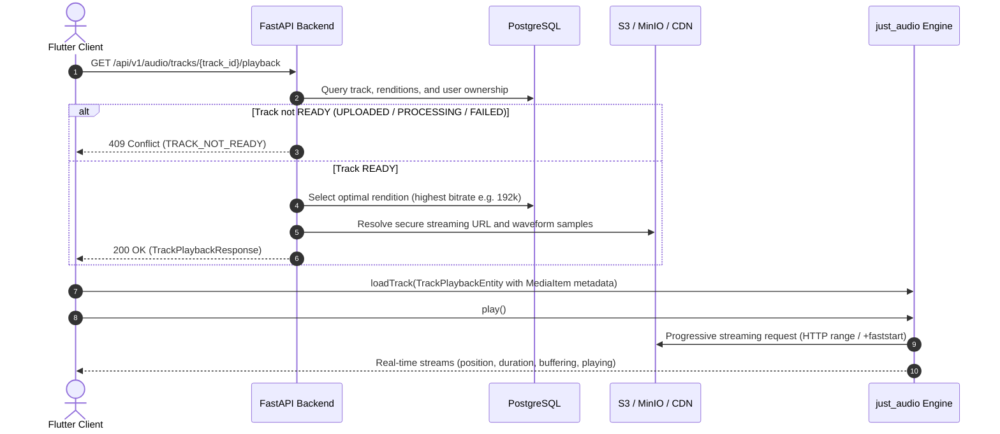
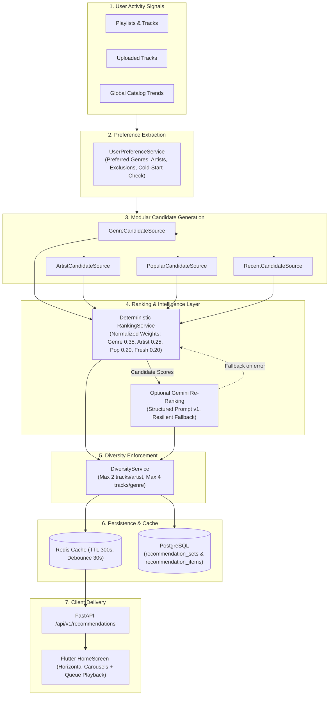
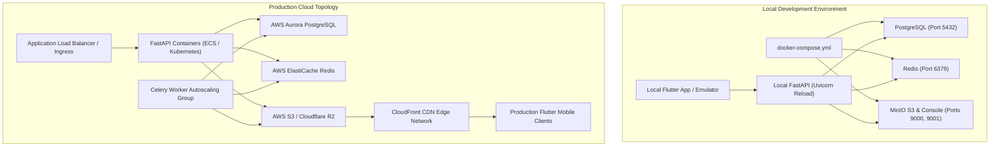
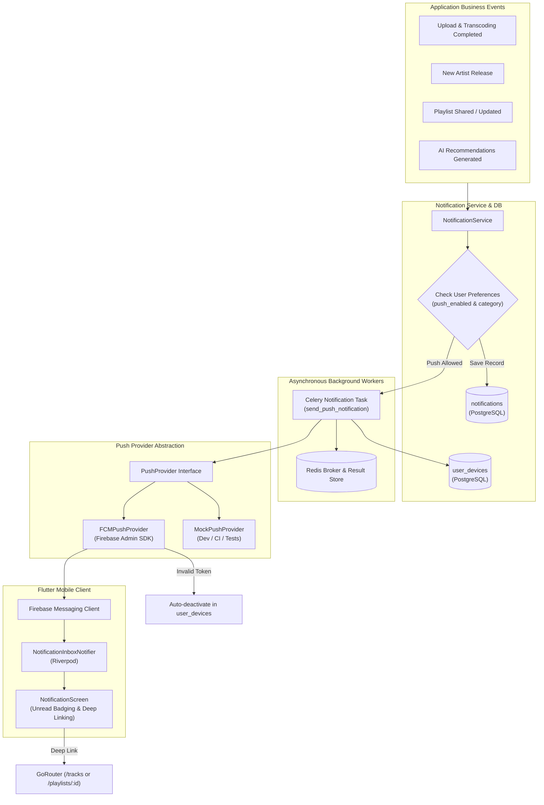
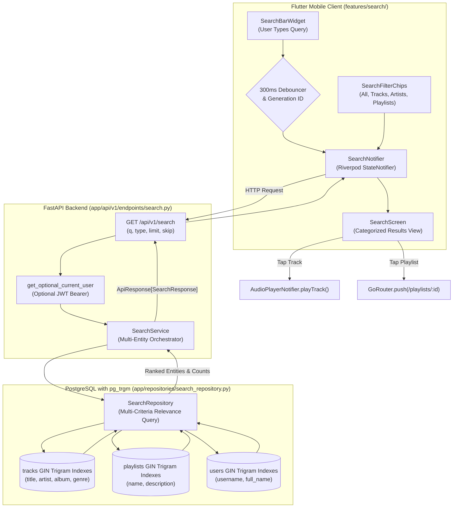
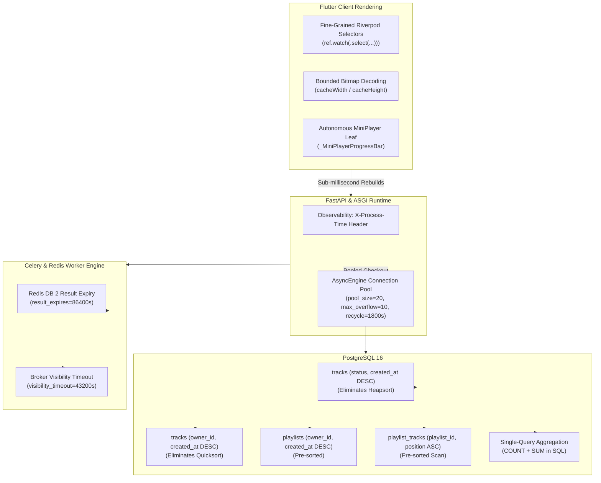

# HUMS — System Architecture & Design Specification

**Document Version:** 1.0.0  
**Status:** Approved Baseline  
**Architecture Paradigm:** Clean Architecture / Feature-First / Micro-Service Ready Monolith  

---

## 1. High-Level System Architecture

Hums is engineered as a decoupled, asynchronous audio streaming platform. It enforces strict separation of concerns across clients, API gateways, storage engines, background processing queues, and media distribution channels.



---
## 2. Technology Stack & Rationale

| Domain | Technology | Justification |
| :--- | :--- | :--- |
| **Mobile Client** | Flutter / Dart | Single cross-platform codebase, hardware-accelerated rendering, 60/120fps UI smoothness, robust audio service integration. |
| **Client State Management** | Riverpod 2.x | Compile-time safety, unidirectional data flow, testability without BuildContext dependency, no boilerplate compared to Bloc. |
| **Client Routing** | go_router | Declarative URL-based routing, deep linking, nested navigation state for persistent mini-players. |
| **Client Network** | Dio | Interceptors for transparent JWT refresh, request cancellation, progress tracking during audio upload. |
| **Backend Framework** | FastAPI | High-throughput asynchronous Python (ASGI), native Pydantic v2 data validation, automated OpenAPI docs. |
| **ORM / Database** | SQLAlchemy 2.0 + asyncpg | Fully asynchronous DB access, strict typing, relationship mapping, non-blocking I/O. |
| **Schema Migrations** | Alembic | Version-controlled, deterministic database schema evolutions. |
| **Message Broker / Cache** | Redis | Low-latency caching, rate limiting, and reliable message queue for Celery. |
| **Background Processing** | Celery + FFmpeg | Offloads audio transcoding, metadata extraction, and waveform calculation completely away from HTTP request cycles. |
| **Object Storage** | S3-Compatible (MinIO / S3 / R2) | Infinite horizontal scale for multi-gigabyte audio catalogs with presigned URL support. |

---

## 3. Backend Architecture: Clean Layered Pattern

The backend strictly enforces the following unidirectional flow:



### Architectural Guardrails
1. **Zero Business Logic in Routers:** Routers only handle request parsing, calling services, and formatting API responses.
2. **Zero Raw SQL in Services:** All queries pass through concrete `Repository` classes utilizing SQLAlchemy 2.0 async sessions.
3. **Dependency Injection:** Database sessions, Redis clients, current authenticated users, and services are injected using FastAPI `Depends()`.
4. **Consistent Response Envelope:** All endpoints return a structured envelope:
   ```json
   {
     "success": true,
     "data": { ... },
     "meta": { "timestamp": "...", "version": "1.0.0" }
   }
   ```
   Or for errors:
   ```json
   {
     "success": false,
     "error": {
       "code": "RESOURCE_NOT_FOUND",
       "message": "The requested entity does not exist",
       "details": {}
     }
   }
   ```

---

## 4. Flutter Architecture: Feature-First Clean Architecture

The mobile application utilizes a modular feature-first directory layout:

```text
mobile/lib/
├── core/
│   ├── config/              # App & environment configuration
│   ├── network/             # Dio client, interceptors, error parsers
│   ├── theme/               # Colors, typography, spacing, dimensions, theme
│   ├── utils/               # Audio formatters, date helpers
│   └── widgets/             # Global reusable components
├── routing/
│   ├── app_router.dart      # GoRouter configuration & guards
│   └── route_names.dart     # Route constants
└── features/
    ├── auth/                # Authentication feature
    │   ├── data/            # Data sources, DTOs, repository impl
    │   ├── domain/          # Entities, repository contracts, use cases
    │   └── presentation/    # Riverpod providers, UI screens, widgets
    └── common/              # Splash, home, error states
```

### State Management Guidelines
* **StateNotifier / AsyncNotifier:** Manage screen and domain state with explicit loading, data, and error unions.
* **Immutability:** Use Freezed or immutable Dart data classes for all state models.
* **Separation of Presentation and Network:** UI widgets consume Riverpod providers and never instantiate Dio or invoke API endpoints directly.

---

## 5. Audio Ingestion & Processing Architecture

Audio upload and ingestion is strictly validated, persisted, and enqueued as an asynchronous processing job. Asynchronous processing runs via Celery workers with FFmpeg and ffprobe to ensure zero degradation of HTTP API latency.



### 5.1 Storage Key Convention & Isolation
Audio assets are stored in object storage using deterministic, collision-proof paths:
* **Original Uploads:** `audio/original/{user_id}/{track_id}/{file_uuid}.{canonical_ext}`
* **Processed Renditions:** `audio/processed/{track_id}/{rendition_id}.m4a`
* **Waveforms:** `audio/waveforms/{track_id}.json`
* **Security:** Client-supplied filenames are never used for object keys.
* **Integrity:** If database persistence fails after file upload, the uploaded S3 object is immediately deleted in a rollback catch block.
* **Ownership Isolation:** All queries for tracks (`/api/v1/audio/tracks`, `/api/v1/audio/tracks/{track_id}`, `/api/v1/audio/tracks/{track_id}/status`, `/api/v1/audio/tracks/{track_id}/waveform`) enforce user ownership (`owner_id == current_user.id`), returning 404 for unauthorized access attempts.

### 5.2 Concurrency, Idempotency & Failure Handling
* **Atomic Claim:** Background workers claim jobs using atomic `UPDATE processing_jobs ... WHERE status IN ('PENDING', 'FAILED') ... RETURNING`, preventing race conditions when multiple workers run concurrently.
* **Idempotent Execution:** If a track is already in `READY` status or a job is `COMPLETED`, the worker terminates early as a safe no-op.
* **Short DB Transactions:** Database sessions are strictly bounded to metadata updates (claim, completion/failure). Long-running FFmpeg transcoding and S3 operations execute outside open database connections to prevent pool exhaustion.
* **Temp File Cleanup:** All local transcode files are generated inside a `tempfile.TemporaryDirectory` and guaranteed to be deleted in `finally` blocks.
* **Error Sanitization:** Diagnostic errors logged for workers are sanitized before storing in `processing_jobs.error_message`, stripping internal filesystem paths and sensitive credentials.


---

## 6. Security & Authentication Architecture

### 6.1 Principles & Core Security
1. **Self-Sovereign Identity:** Hums operates with complete autonomy—no third-party auth services (Firebase, Auth0, Supabase, AWS Cognito) or shared database tables with external applications.
2. **Cryptographic Standard:** Passwords hashed using PBKDF2 with SHA-256 (600,000 iterations) via `passlib.context.CryptContext`. Plaintext credentials and tokens are never stored, returned, or logged.
3. **Enumeration-Safe Responses:** Login errors return generic `INVALID_CREDENTIALS` (401) with "Invalid email or password" without revealing whether an email exists. Forgot-password returns identical success messaging for registered and unregistered emails alike.

### 6.2 Token Pair Lifecycle & Rotation
* **Access Token:** Short-lived JWT (default: 30 minutes, HS256) containing:
  * `sub`: Subject UUID of the user
  * `exp`: Expiration Unix timestamp
  * `iat`: Issuance Unix timestamp
  * `type`: "access"
  * `jti`: Cryptographically unique UUID identifier for token tracking
* **Refresh Token:** Long-lived cryptographically secure 32-byte hex token (default: 7 days):
  * Only the SHA-256 hash is persisted in the `refresh_tokens` PostgreSQL table.
  * Every refresh operation performs **Strict Token Rotation**: the previous token is marked `is_revoked = True` with `revoked_at = NOW()`, and an entirely new token pair is issued.
* **Session Revocation:**
  * User logout marks the specified refresh token revoked in the database.
  * Successful password reset automatically revokes all active refresh tokens across all devices for that user.
* **Password Reset Tokens:**
  * Single-use cryptographically secure 32-byte hex token with a 15-minute expiration window.
  * Stored as SHA-256 hash in `password_reset_tokens`. Marked `is_used = True` upon execution.

### 6.3 Mobile Client Authentication Architecture
* **Secure Storage:** Tokens and cached user profiles are saved to `FlutterSecureStorage` utilizing the iOS Keychain and Android EncryptedSharedPreferences (AES-256 GCM).
* **Transparent Token Refresh (`AuthInterceptor`):**
  * Automatically injects `Authorization: Bearer <token>` into outbound requests.
  * Bypasses auth endpoints (`/auth/login`, `/auth/register`, `/auth/refresh`, `/auth/forgot-password`, `/auth/reset-password`).
  * Intercepts `401 Unauthorized` responses, synchronizes token refresh through a mutex lock to avoid duplicate concurrent refresh calls, updates secure storage, and retries the original request with a `retried: true` flag to prevent infinite loops.
* **State Management & Routing Guards:**
  * `AuthNotifier` (StateNotifier) manages immutable Freezed `AuthState` unions (`initial`, `loading`, `authenticated`, `unauthenticated`, `failure`).
  * `RouterNotifier` (`ChangeNotifier`) listens to `authNotifierProvider` and drives `GoRouter`'s `refreshListenable`, enabling reactive redirection (unauthenticated users to `/login`, authenticated users away from login/signup/reset to `/home`) without recreating the `GoRouter` instance or losing navigation state.

---

## 7. Profile Architecture & Avatar Processing

### 7.1 Unified Account & Profile Design
To maintain database simplicity and eliminate redundant joins, core identity and profile metadata reside within the `users` table:
* `name` (backed by `full_name` or `username` fallback)
* `email` (case-insensitive normalized, unique)
* `bio` (optional string, max 500 characters)
* `avatar_url` (public CDN URL to processed WebP avatar)

Partial updates (`PATCH /api/v1/profile`) inspect provided fields via Pydantic `exclude_unset=True`. When changing email, the service validates email format, normalizes to lowercase, and enforces uniqueness across the database before updating.

### 7.2 Avatar Storage Flow & Validation Pipeline


### 7.3 Storage Abstraction Layer
All media storage interacts exclusively through `BaseStorageService`, completely decoupling business logic from concrete storage providers:
* **Development:** MinIO over local Docker network.
* **Production:** AWS S3 or Cloudflare R2 configured seamlessly via environment variables (`S3_ENDPOINT`, `S3_ACCESS_KEY`, `S3_SECRET_KEY`, `S3_BUCKET`).
* **Non-Blocking I/O:** `S3StorageService` dispatches boto3 SDK calls to an asynchronous thread pool via `asyncio.to_thread` to ensure zero blocking of the FastAPI event loop.

## 8. Storage Abstraction Layer

All file operations route through an abstract `StorageService` interface:

```python
class StorageService(ABC):
    async def upload_file(self, file_data: bytes, destination_key: str, content_type: str) -> str: ...
    async def get_presigned_url(self, key: str, expires_in: int = 3600) -> str: ...
    async def delete_file(self, key: str) -> bool: ...
```

* **Local / Dev:** MinIO client implementing S3 API over HTTP.
* **Production:** AWS S3 or Cloudflare R2 configured seamlessly via environment variables without touching domain logic.

---

## 8. Audio Playback & Streaming Architecture

### 8.1 Playback Resolution & Delivery Flow



### 8.2 Client-Side Audio Engine & Lifecycle
* **Single Audio Engine Instance:** Managed globally by `AudioPlayerService` via Riverpod `audioPlayerServiceProvider` to prevent overlapping playback or resource leaks.
* **Background Playback & OS Media Integration:** `just_audio_background` synchronizes track metadata (`title`, `artist`, `album`, `duration`) with system lock screens, notifications, and control centers on iOS and Android with foreground service permissions (`FOREGROUND_SERVICE_MEDIA_PLAYBACK`).
* **Clean Architecture Layers:**
  - **Domain:** `TrackPlaybackEntity`, `AudioSourceEntity`, `PlayerError` (`PlayerErrorType`), `AudioPlayerRepository`.
  - **Data:** `AudioPlayerRemoteDataSource` (calling `/api/v1/audio/tracks/{id}/playback`), `AudioPlayerService` (wrapping `just_audio`), `AudioPlayerRepositoryImpl`.
  - **Presentation:** `AudioPlayerNotifier` (StateNotifier) managing `PlayerState` (`idle`, `loading`, `ready`, `playing`, `paused`, `buffering`, `completed`, `error`).
* **UI Components:**
  - **MiniPlayer:** Persistent bar at the bottom of the screen with active track info, linear progress, play/pause, and navigation to the full player.
  - **FullPlayerScreen:** Comprehensive view with vinyl/waveform card, amplitude waveform visualization, interactive scrubber, timestamps, seek (-10s / +30s), error banner with retry, and rendition quality badge.
* **Custom SVG Icon System:** All playback controls strictly use custom SVGs via `AppIcon` and `AppIcons` (`play.svg`, `pause.svg`, `seek_backward_10.svg`, `seek_forward_30.svg`, `waveform.svg`, `music_note.svg`, `close.svg`, `error.svg`, `playlist.svg`, `add.svg`, `edit.svg`, `delete.svg`, `more.svg`, `drag.svg`, `remove.svg`, `next.svg`, `previous.svg`, `back.svg`). Material or Cupertino playback icons are prohibited.

---

## 9. Playlists & Playback Queue Architecture

### 9.1 Relational Playlist Design & Invariants
* **User Ownership Isolation:** All playlist operations (`CREATE`, `READ`, `UPDATE`, `DELETE`, `COVER`, `ADD_TRACK`, `REMOVE_TRACK`, `REORDER`) enforce strict user ownership. Users cannot query, modify, or delete playlists owned by other users.
* **Normalized Track Ordering:** The `playlist_tracks` join table uses zero-based sequential integers for `position`.
  - Adding a track appends it to position `max(position) + 1` (or 0 if empty).
  - Removing a track automatically normalizes subsequent positions to preserve a dense, non-sparse zero-based sequence.
  - Reordering tracks (`PATCH /api/v1/playlists/{id}/tracks/reorder`) executes atomically in a single transaction, mapping incoming track IDs to positions `0..N-1`.
  - Unique constraint `(playlist_id, track_id)` prevents duplicate track memberships within the same playlist.
* **Derived Metadata:** `track_count` and `duration_seconds` are dynamically derived from active track associations and underlying `tracks.duration_seconds` values.
* **Cover Artwork Pipeline:** Uploaded cover artwork (JPEG, PNG, WebP up to 5MB) is sanitized, converted to WebP (800x800 max, 85% quality) via Pillow, and stored in S3/MinIO at `playlists/covers/{playlist_id}/{uuid}.webp`. Removing a cover safely deletes the object from storage.

### 9.2 Mobile PlayerQueue & Continuous Playback Integration
* **Queue Model:** `PlayerQueue` holds an ordered list of `QueueItem` objects, tracking `playlistId`, `playlistName`, and `currentIndex`.
* **Playable Track Filtering:** Only tracks with `status == 'READY'` are queued for audio streaming. If an unplayable track is encountered, the player automatically skips to the next playable item.
* **Queue Navigation:**
  - `playQueue(PlayerQueue queue, {int startIndex = 0})`: Loads the queue and immediately initiates streaming from `startIndex`.
  - `skipToNext()` / `skipToPrevious()`: Traverses the queue bidirectionally to the next/previous playable track.
  - **Auto-Advance:** When a track finishes playing (`PlayerStatus.completed`), `AudioPlayerNotifier` automatically advances playback to the next playable track in the active queue.
* **UI Integration:**
  - `PlaylistDetailScreen` features `SliverReorderableList` enabling fluid drag-and-drop track reordering that syncs atomically with the backend.
  - `MiniPlayer` and `FullPlayerScreen` expose Next / Previous controls reflecting the active playlist queue state.

---

## 10. AI Recommendation Engine Architecture

Hums features a production-grade, multi-stage backend recommendation engine that synthesizes user activity signals, deterministic candidate generation, normalized scoring, optional semantic Gemini AI re-ranking, and diversity filtering before caching and persisting results.



### 10.1 Pipeline Stages
1. **User Preference Extraction (`UserPreferenceService`):**
   - Scans user playlists and uploaded tracks to identify preferred genres and top artists with frequency weighting.
   - Collects excluded track IDs (e.g. tracks already created by the user) to avoid redundant self-recommendations.
   - Detects **cold-start** state when listening/curation history is insufficient.
2. **Modular Candidate Generation (`CandidateGenerationService`):**
   - Implements the `CandidateSource` protocol with four decoupled sources:
     - `GenreCandidateSource`: Finds `READY` tracks matching user's preferred genres.
     - `ArtistCandidateSource`: Discovers `READY` tracks by user's preferred artists.
     - `PopularCandidateSource`: Retrieves top catalog tracks by play count.
     - `RecentCandidateSource`: Surfaces recently ingested and published tracks.
   - Ensures candidate pool deduplication, excludes unavailable/failed tracks, and respects limit parameters.
3. **Deterministic Scoring & Configurable Weights (`RankingService`):**
   - Calculates a normalized multi-signal score in `[0.0, 1.0]`:
     $$\text{Score} = w_{\text{genre}} \cdot S_{\text{genre}} + w_{\text{artist}} \cdot S_{\text{artist}} + w_{\text{pop}} \cdot S_{\text{pop}} + w_{\text{fresh}} \cdot S_{\text{fresh}}$$
   - Weights are centralized in `RecommendationWeights` (`genre=0.35`, `artist=0.25`, `popularity=0.20`, `freshness=0.20`).
4. **Optional Gemini AI Semantic Re-Ranking (`GeminiRecommendationClient`):**
   - When a valid `GEMINI_API_KEY` is present, passes a sanitized, structured JSON payload of top candidates and user preference signals to the modern `google-genai` SDK (`gemini-2.5-flash`).
   - Uses strict system instructions and a centralized prompt version (`RECOMMENDATION_PROMPT_VERSION = "v1"`).
   - **Resilient Fallback:** Automatically falls back to deterministic ranking if Gemini times out, returns malformed JSON, or encounters API rate limits.
   - **Privacy & Security:** Zero PII (no emails, passwords, usernames, or internal auth tokens) is sent to Gemini. Untrusted user-provided metadata is sanitized.
5. **Diversity Enforcement (`DiversityService`):**
   - Prevents echo chambers by enforcing configurable limits:
     - Maximum 2 tracks per artist.
     - Maximum 4 tracks per genre.
6. **Multi-Section Composition (`RecommendationService`):**
   - Generates four distinct presentation sections:
     - `for-you`: Primary personalized recommendations.
     - `genre`: Focused on the user's highest-affinity genre.
     - `trending`: Catalog-wide popular tracks.
     - `discover`: Fresh, diverse tracks the user hasn't yet heard.
   - If cold-start is detected, provides high-quality trending, fresh, and genre-diverse catalog sections.

### 10.2 Caching, Lock Deduplication & Asynchronous Workers
- **Redis Cache Strategy:** Recommendation responses are cached in Redis with a 300-second TTL (`rec:{user_id}:{limit}`).
- **Debounced Refresh & Distributed Locking:**
  - `POST /api/v1/recommendations/refresh` sets a 30-second debounce key to prevent cache-busting floods.
  - Concurrency lock (`rec:lock:{user_id}`) prevents duplicate parallel recommendation computations.
- **Celery Asynchronous Task (`generate_user_recommendations`):**
  - Dispatched in the background on cache misses or explicit refresh requests.
  - Generates, persists to PostgreSQL, and repopulates the Redis cache.

### 10.3 Persistence & Schema
- `recommendation_sets`: Tracks generated recommendation batches (`user_id`, `algorithm_version`, `expires_at`).
- `recommendation_items`: Links recommended tracks to a set with zero-based sequential ordering (`position`), unique constraint `(recommendation_set_id, track_id)`, and foreign keys with cascade deletion.

---

## 11. Development vs. Production Infrastructure



---

## 12. Future AI Roadmap

AI features are encapsulated within domain-specific service adapters:
- **Genre Tagging & Audio Classification:** Background audio analysis using Gemini multimodal models.
- **Transcript Generation:** Speech-to-text podcast transcription and timestamp indexing.

No core audio streaming dependency relies synchronously on Gemini availability, guaranteeing uninterrupted playback even during third-party AI outages.

---

## 13. Push Notification Architecture

Hums implements a scalable, backend-driven push notification architecture decoupled from synchronous HTTP requests.



### Key Architectural Principles:
1. **Asynchronous Non-Blocking Delivery:** Route handlers and media processing pipelines never block waiting for push responses. They enqueue Celery delivery tasks.
2. **Provider Isolation:** `PushProvider` interface abstracts vendor specifics. `FCMPushProvider` handles multi-platform FCM delivery while `MockPushProvider` enables hermetic local development and zero-network CI testing.
3. **Multi-Device Support:** Users can sign in on multiple Android/iOS devices; notifications are broadcasted via multicast to all active tokens owned by the user.
4. **Resilient Token Pruning:** Stale, uninstalled, or invalid tokens reported by FCM (`UnregisteredError`, `SenderIdMismatchError`) are automatically deactivated in `user_devices` upon multicast delivery.
5. **Idempotency & Deduplication:** Notifications accept an `idempotency_key` ensuring duplicate events (e.g. repeated Celery task executions) do not generate duplicate inbox entries or push notifications.
6. **Graceful Degradation:** If push delivery fails due to transient network issues, tasks retry up to 3 times with exponential backoff (`10 * 2^retries`). If push remains disabled or fails entirely, the in-app notification inbox record remains safe and accessible.

---

## 12. Catalog Search Architecture

Hums implements a high-performance, backend-driven catalog search engine built entirely on native PostgreSQL indexing, eliminating the operational overhead and synchronization lag of external search microservices (e.g., Elasticsearch, Algolia).



### Key Architectural Pillars:
1. **PostgreSQL-Native Trigram Search (`pg_trgm`):**
   - Utilizes GIN trigram indexes (`gin_trgm_ops`) on high-traffic text attributes across tracks, artists, and playlists.
   - Provides fast case-insensitive substring searching (`ILIKE '%term%'`) and fuzzy typo-tolerant word similarity (`word_similarity(query, column) > 0.35`).
2. **Deterministic Relevance Scoring Engine:**
   - Multi-criteria weighted scoring algorithm prioritizes exact phrase matches, prefix matches, relevant substrings, and trigram word similarities.
   - Total deterministic ordering achieved through tie-breaking on `created_at DESC, id DESC`, preventing pagination skew or duplicate rows across pages.
3. **Strict Privacy Isolation:**
   - **Tracks:** Hard-filtered by `status == 'READY'`. Non-ready audio pieces (uploaded, transcode pending, processing, failed) are never exposed.
   - **Playlists:** Strict tenant filtering: `is_public == TRUE OR owner_id == current_user_id`. Guests never view private playlists; authenticated users view only their own private playlists.
   - **Artists:** Aggregate counts from active creator accounts and verified track metadata.
4. **Client-Side Concurrency & Debounce Protection:**
   - Flutter `SearchNotifier` enforces a 300ms debounce interval to avoid spamming the backend while typing.
   - Monotonically increasing generation IDs (`_generationId`) protect against network race conditions, guaranteeing that slower earlier requests cannot overwrite results from newer keystrokes.
5. **Continuous Playback Ecosystem Integration:**
   - Tapping any search track result immediately triggers playback through Hums' global audio player service (`audioPlayerNotifierProvider.notifier.playTrack()`), preserving queue continuity and showing live playback indicators.

---

## 14. Production Performance & Reliability Architecture

The Hums architecture enforces strict performance and resource constraints across database operations, asynchronous task queues, and mobile rendering lifecycles:



### Architectural Directives:
1. **Zero Unnecessary Client-Side Rebuilds:**
   - Widgets must never subscribe to composite or high-frequency state objects in their entirety.
   - Playback progress updates (1Hz ticks) are strictly isolated to dedicated progress bar leaf widgets (`_MiniPlayerProgressBar`) using `audioPlayerNotifierProvider.select((s) => s.progress)`.
   - List and tile views select only boolean states (e.g. `s.track?.trackId == track.id` and `s.isPlaying`), preventing dirty frame cascades across unaffected list elements.
2. **Deterministic Mobile Memory Bounding:**
   - Remote artwork rendered with `Image.network` or `NetworkImage` must specify `cacheWidth` and `cacheHeight` (or be wrapped with `ResizeImage`).
   - Prevents uncompressed full-resolution raster buffers (up to 16.8 MB per 2048x2048 asset) from residing in GPU/graphics RAM, reducing per-image memory footprint to under 200 KB.
3. **Database Pre-Sorted Index Scans & Single-Query Aggregations:**
   - High-throughput query paths must be supported by composite indexes matching the exact filter and sort order to eliminate runtime sorting (`quicksort` or `top-N heapsort`).
   - Entity counts and duration aggregations must be computed natively in the PostgreSQL engine via `COUNT` and `COALESCE(SUM(...), 0)` rather than hydrating ORM child collections into application memory.
4. **Resilient Connection Pooling & Stale Socket Pruning:**
   - Async SQLAlchemy engines must configure connection recycling (`pool_recycle = 1800`), fail-fast timeouts (`pool_timeout = 30`), and pre-ping validation to withstand network partition drops and sudden connection spikes.
5. **Bounded Redis Memory Retention:**
   - Celery background workers storing results in Redis must declare explicit TTL expiration (`result_expires = 86400`) to guarantee that ephemeral task outcomes do not consume persistent memory.

---

## 12. Security Architecture & Threat Defenses

### 12.1. Authentication & Token Management
* **JWT Access & Refresh Tokens:** High-entropy HMAC-SHA256 tokens.
* **Sliding Refresh Sessions:** Refresh tokens are single-use, rotated on consumption, and stored with cryptographic hashes.
* **Password Hashing:** Passwords hashed with high-cost Bcrypt/Argon2. Password inputs are strictly bounded to 128 characters to prevent CPU starvation attacks.

### 12.2. Rate Limiting & Abuse Prevention
* **Engine:** Distributed Redis-backed sliding/fixed-window counter (`RateLimiter`).
* **Granular Scopes:** Applied per user ID (for authenticated callers) or per client IP (for unauthenticated callers).
* **Feedback:** Emits RFC 6585-compliant `Retry-After: {seconds}` headers on HTTP 429 status codes.
* **Resilience:** Graceful fail-open mechanism ensures Redis network partitions never cause total service denial.

### 12.3. File Upload Safety & Resource Bounds
* **Bounded Stream Reading:** Streaming reader (`read_upload_file_bounded`) consumes incoming file chunks up to specified maximum byte limits, aborting immediately upon threshold violation.
* **Image Processing Security:** Image covers and avatars are decoded with Pillow, verifying valid MIME types and headers while bounding maximum pixel dimensions to neutralize decompression bombs.
* **Storage Isolation:** Uploads are stored under UUID keys; arbitrary client filenames are never used as filesystem or storage paths.

### 12.4. Defensive HTTP Headers
All API responses include defensive security headers:
* `X-Content-Type-Options: nosniff`
* `X-Frame-Options: DENY`
* `X-XSS-Protection: 1; mode=block`
* `Referrer-Policy: strict-origin-when-cross-origin`
* `Permissions-Policy: camera=(), microphone=(), geolocation=()`
* `Strict-Transport-Security: max-age=31536000; includeSubDomains` (in production)

### 12.5. Container Least Privilege
* Containerized backend processes execute under an unprivileged user (`appuser`, UID 1000).
* Root privileges are prohibited within application containers.
