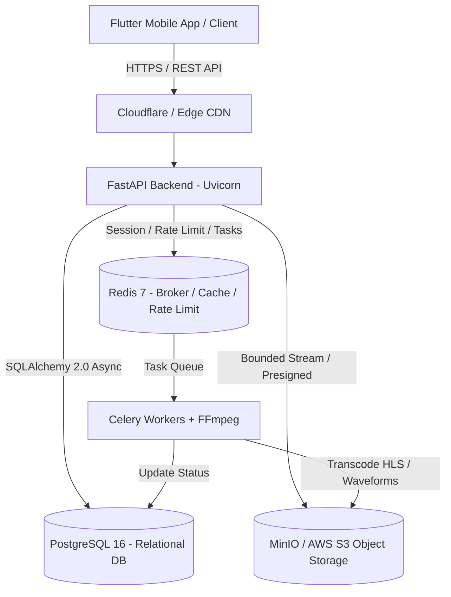

# Hums System Architecture

---

## 1. High-Level System Overview

**Hums** is an autonomous, independent audio streaming and podcast platform engineered for high audio fidelity, low latency, and horizontally scalable cloud operations.

---

## 2. Core Architectural Pillars

### 2.1. Mobile Application (Flutter & Riverpod)
* **Architecture:** Feature-first modular clean architecture.
* **State Management:** Riverpod 2.x with auto-dispose providers and immutable state representations via Freezed.
* **Navigation:** `go_router` declarative routing with guarded auth redirects.
* **Networking:** Dio HTTP client configured with queued token refresh (`AuthInterceptor`) and release-mode guarded logging (`LoggingInterceptor`).
* **Session Storage:** Secure hardware-backed storage (`FlutterSecureStorage` using iOS Keychain and Android EncryptedSharedPreferences).

### 2.2. Application Backend (FastAPI & Python 3.11+)
* **Framework:** FastAPI ASGI running on Uvicorn.
* **Database ORM:** SQLAlchemy 2.0 async engine with `asyncpg` driver and connection pooling.
* **Data Validation:** Pydantic v2 schemas enforcing strict field bounds, email validation, and type coercion.
* **Error Handling:** Centralized application exception hierarchy mapping domain errors to RFC-compliant JSON responses.

### 2.3. Asynchronous Audio Processing (Celery & FFmpeg)
* **Task Broker:** Redis DB 1 for task queuing and state persistence.
* **Media Transcoding:** FFmpeg processes uploaded raw audio files into multi-bitrate HLS streams (AAC 64k, 128k, 256k, 320k) and generates 100-point normalized JSON waveform data.
* **Safety:** FFmpeg execution runs inside isolated containerized workers with strict non-root user permissions.

---

## 3. Security Architecture & Threat Defenses

### 3.1. Authentication & Token Management
* **JWT Access & Refresh Tokens:** High-entropy HMAC-SHA256 tokens.
* **Sliding Refresh Sessions:** Refresh tokens are single-use, rotated on consumption, and stored with cryptographic hashes.
* **Password Hashing:** Passwords hashed with high-cost Bcrypt/Argon2. Password inputs are strictly bounded to 128 characters to prevent CPU starvation attacks.

### 3.2. Rate Limiting & Abuse Prevention
* **Engine:** Distributed Redis-backed sliding/fixed-window counter (`RateLimiter`).
* **Granular Scopes:** Applied per user ID (for authenticated callers) or per client IP (for unauthenticated callers).
* **Feedback:** Emits RFC 6585-compliant `Retry-After: {seconds}` headers on HTTP 429 status codes.
* **Resilience:** Graceful fail-open mechanism ensures Redis network partitions never cause total service denial.

### 3.3. File Upload Safety & Resource Bounds
* **Bounded Stream Reading:** Streaming reader (`read_upload_file_bounded`) consumes incoming file chunks up to specified maximum byte limits, aborting immediately upon threshold violation.
* **Image Processing Security:** Image covers and avatars are decoded with Pillow, verifying valid MIME types and headers while bounding maximum pixel dimensions to neutralize decompression bombs.
* **Storage Isolation:** Uploads are stored under UUID keys; arbitrary client filenames are never used as filesystem or storage paths.

### 3.4. Defensive HTTP Headers
All API responses include defensive security headers:
* `X-Content-Type-Options: nosniff`
* `X-Frame-Options: DENY`
* `X-XSS-Protection: 1; mode=block`
* `Referrer-Policy: strict-origin-when-cross-origin`
* `Permissions-Policy: camera=(), microphone=(), geolocation=()`
* `Strict-Transport-Security: max-age=31536000; includeSubDomains` (in production)

### 3.5. Container Least Privilege
* Containerized backend processes execute under an unprivileged user (`appuser`, UID 1000).
* Root privileges are prohibited within application containers.
