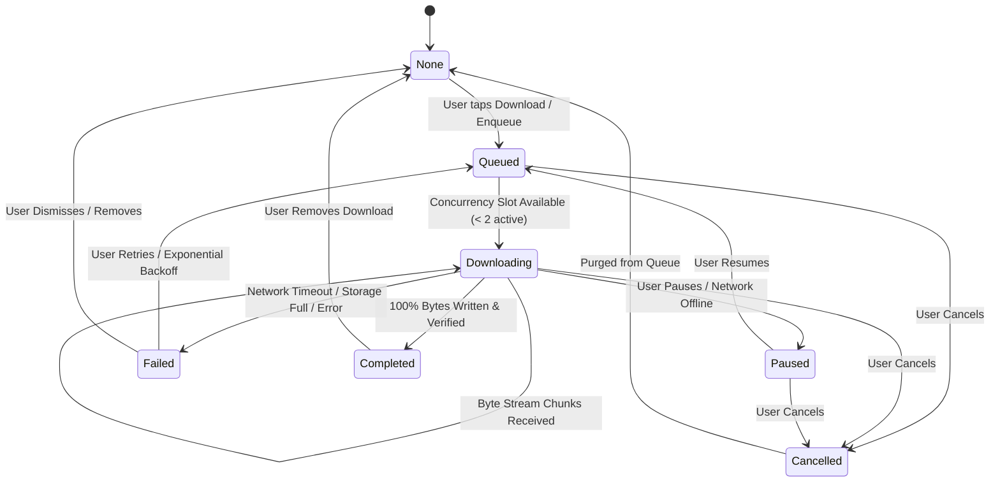

# Hums Download State Machine & Lifecycle

## Overview

The download lifecycle is governed by a deterministic, persistent state machine implemented in `DownloadManager` and represented by `DownloadStatus`. State transitions are stored atomically in `downloads_db.json` and mirrored in Riverpod's `DownloadState`.

---

## 1. State Diagram

---

## 2. State Definitions

| State | Enum Name | Description | Local File Status |
| :--- | :--- | :--- | :--- |
| **None** | `null` | Track is not downloaded or enqueued. | No local directory or file. |
| **Queued** | `DownloadStatus.queued` | Download authorized; waiting for an execution slot. | Directory created; 0 bytes downloaded. |
| **Downloading** | `DownloadStatus.downloading` | Active HTTP stream writing bytes to disk. | `audio.part` file growing in size. |
| **Paused** | `DownloadStatus.paused` | Stream paused by user or network suspension. | `audio.part` preserved for Range resumption. |
| **Completed** | `DownloadStatus.completed` | Audio verified and ready for offline playback. | `audio.m4a` atomically finalized and verified. |
| **Failed** | `DownloadStatus.failed` | Unrecoverable HTTP, storage, or auth error occurred. | `audio.part` may exist; retains error message. |
| **Cancelled** | `DownloadStatus.cancelled` | User explicitly cancelled download during progress. | `audio.part` immediately deleted. |
| **Removing** | `DownloadStatus.removing` | Deletion in progress. | Track directory recursively deleted. |

---

## 3. Transition Events & Invariants

### 3.1 Enqueue (`None -> Queued`)
- **Trigger**: User taps download icon on track tile, playlist, or player.
- **Actions**:
  1. Requests signed URL from backend (`GET /api/v1/tracks/{trackId}/download`).
  2. Records track metadata (title, artist, album, format, bitrate, file size, waveform).
  3. Writes record to `downloads_db.json`.
  4. Triggers `_processQueue()`.

### 3.2 Start Execution (`Queued -> Downloading`)
- **Condition**: Number of active downloads with status `downloading` is less than `maxConcurrentDownloads` (default: 2).
- **FIFO Guarantee**: Oldest queued item by `createdAt` timestamp starts first.
- **Actions**:
  1. Checks if signed URL is expired (`isUrlExpired`); if expired, automatically re-authorizes.
  2. Opens append stream on `${appDocDir}/downloads/${userId}/${trackId}/audio.part`.
  3. If `.part` file already contains bytes > 0, sets header `Range: bytes={existingBytes}-`.
  4. Creates a `CancelToken` mapped to `trackId`.

### 3.3 Progress Updates (`Downloading -> Downloading`)
- **Throttle Rule**: To protect Flutter's rendering pipeline from high-frequency chunk callbacks, state notifications are emitted at most **once every 250 milliseconds** per track.
- **Calculations**: `progress = (receivedBytes / totalBytes).clamp(0.0, 1.0)`.

### 3.4 Pause (`Downloading -> Paused`)
- **Trigger**: User taps pause or app enters network-restricted state.
- **Actions**:
  1. Cancels active HTTP request via `CancelToken.cancel('User paused')`.
  2. Flushes and closes file sink on `audio.part`.
  3. Saves status `paused` with current `bytesDownloaded`.
  4. Calls `_processQueue()` to grant the freed execution slot to the next queued item.

### 3.5 Resume (`Paused -> Queued`)
- **Trigger**: User taps resume on a paused track.
- **Actions**:
  1. Sets status to `queued`.
  2. Updates `updatedAt`.
  3. Calls `_processQueue()` to start when a concurrency slot opens.

### 3.6 Completion & Finalization (`Downloading -> Completed`)
- **Condition**: Stream completes successfully and total bytes match expected size.
- **Actions**:
  1. Flushes and closes file sink.
  2. Verifies file byte length > 0.
  3. Performs **atomic rename**: `audio.part` -> `audio.<format>` (`audio.m4a`).
  4. Writes `completedAt = DateTime.now()` and status `completed` to database.
  5. Recalculates total user storage usage.
  6. Emits `download_completed` telemetry event.
  7. Triggers `_processQueue()` for remaining queued items.

### 3.7 Cancellation (`Downloading / Queued / Paused -> Cancelled`)
- **Trigger**: User taps Cancel icon.
- **Actions**:
  1. Cancels in-flight network request.
  2. Asynchronously purges `audio.part` file via `DownloadFileManager.deletePartialFile()`.
  3. Resets progress to 0.0.
  4. Frees queue slot.

### 3.8 Removal (`Completed / Failed -> None`)
- **Trigger**: User deletes track from offline library or taps "Clear All Downloads".
- **Actions**:
  1. Deletes track directory and physical audio files recursively.
  2. Deletes record from `downloads_db.json`.
  3. Recalculates user storage usage in presentation state.

---

## 4. App Restart & Crash Recovery

When the application process terminates abruptly (crash, force quit, or OS termination):
1. On next initialization (`DownloadManager.init`), startup recovery executes:
   - Any items left in `downloading` status are transitioned to `failed` with error message `"Download interrupted by app restart"`.
   - Temporary orphan `.part` files older than 48 hours without active database entries are garbage-collected.
   - For all items marked `completed`, disk verification checks if `localPath` exists and has non-zero size. If missing, status is marked `failed` to prevent playback errors.
