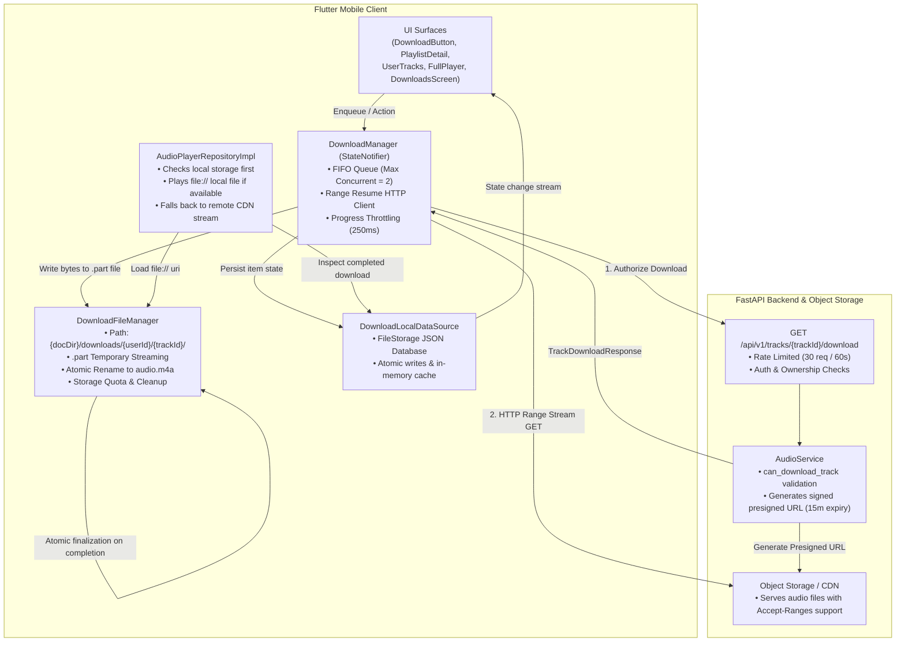

# Hums Offline Downloads & Offline Playback Architecture

## Overview

The Hums Offline Downloads subsystem allows authenticated users to download eligible audio tracks and playlists to local mobile device storage for offline playback. The system ensures robust network-resilience (Range requests, byte resumption), strict multi-user privacy isolation, storage quota awareness, and zero audio player bifurcation: downloaded tracks play seamlessly through the existing global audio player without network calls.

---

## 1. System Architecture



---

## 2. Component Responsibilities

### 2.1 Backend (`FastAPI`)
- **Authorization Endpoint (`GET /api/v1/tracks/{track_id}/download` & `/api/v1/audio/tracks/{track_id}/download`)**:
  - Enforces active authenticated session.
  - Verifies track status is `READY` and media files exist.
  - Enforces ownership/access rules (Security Rule 61: private tracks cannot be downloaded by third parties).
  - Generates short-lived presigned download URLs (`expires_in = 900 seconds / 15 minutes`) preventing URL leakage.
  - Rate-limited via Redis sliding-window algorithm (`30 requests per minute`).

### 2.2 Mobile Client (`Flutter` & `Riverpod`)
- **`DownloadManager` (`StateNotifier<DownloadState>`)**:
  - Orchestrates download lifecycle with a strict FIFO queue (`maxConcurrentDownloads = 2`).
  - Supports pause, resume, cancel, retry with exponential backoff, and removal.
  - Utilizes `Dio` with HTTP Range headers (`Range: bytes={existingBytes}-`) to resume interrupted downloads without re-downloading existing bytes.
  - Throttles Riverpod state emissions (max once every 250ms) to ensure smooth 60fps UI performance during rapid data chunk ingestion.
  - Recovers state gracefully on app restart: marks orphan downloads as failed, runs garbage collection, and checks valid files.

- **`DownloadFileManager`**:
  - Manages filesystem directories under `${appDocDir}/downloads/${userId}/${trackId}/`.
  - Enforces streaming into temporary `.part` files (`audio.part`).
  - Atomically verifies byte length and renames `.part` to `audio.<format>` upon download completion.
  - Provides orphan cleanup, partial file purging on cancel, and aggregate storage calculations.

- **`DownloadLocalDataSource`**:
  - Lightweight, crash-resilient file-backed JSON database (`downloads_db.json`).
  - Provides atomic writes (writing to temporary `.tmp` file and renaming) to guard against corruption during unexpected app termination or power loss.
  - Enforces multi-user isolation: User A's queries will never return User B's downloaded items.

- **`AudioPlayerRepositoryImpl`**:
  - Intercepts playback requests in `getPlaybackSource(trackId)`.
  - Checks if `DownloadLocalDataSource` contains a completed download for `trackId`.
  - If present and local file is valid on disk, constructs `TrackPlaybackEntity` pointing to the local filesystem path.
  - Hands the source directly to `AudioPlayerService` which loads it via `AudioSource.file(localPath)`.
  - Requires **zero separate audio player**: online and offline playback use the exact same player pipeline, equalizer, notification bar, lock screen controls, and progress tracking.

---

## 3. Account Privacy & Storage Isolation

To prevent information disclosure on shared devices:
1. All physical files are stored in user-scoped subdirectories:
   ```text
   ${appDocDir}/downloads/
     └── ${userId}/
         └── ${trackId}/
             └── audio.m4a
   ```
2. When a user logs out or switches accounts:
   - All active download network streams are immediately cancelled via `CancelToken`.
   - `DownloadManager` clears in-memory state.
   - When User B logs in, `DownloadManager.init(userB.id)` loads only User B's persistent download entries from the database.
   - User B cannot see, browse, or play User A's offline tracks.

---

## 4. End-to-End Data Flow

1. **User Action**: User taps `DownloadButton` on a track or "Download All" on a playlist.
2. **Eligibility & Authorization**: `DownloadManager` calls `GET /api/v1/tracks/{track_id}/download`. Backend validates track status and permissions, returning signed URL with 15m expiration.
3. **Queue Assignment**: Item enters `DownloadStatus.queued`. If active downloading count < 2, it transitions to `DownloadStatus.downloading`.
4. **Resumable HTTP Stream**: `Dio` requests byte stream with Range header matching existing `.part` bytes.
5. **Streaming & Progress**: Bytes are appended to `audio.part`. Progress events update state at most every 250ms.
6. **Atomic Verification**: Upon stream completion, byte count is compared to `content-length`/metadata. The file is atomically renamed to `audio.m4a`. Item status becomes `DownloadStatus.completed`.
7. **Offline Playback**: User opens app offline and taps Play. `AudioPlayerRepositoryImpl` detects local completed file and supplies it to `just_audio` player with zero network roundtrips.
