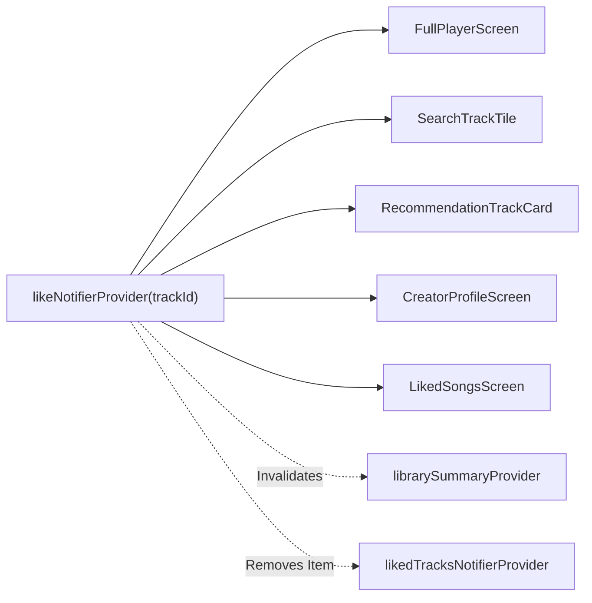

# Personal Library Synchronization & Caching Strategy

## 1. Multi-Tiered Caching & Invalidation Architecture

To deliver low latency (<50ms) across millions of monthly active users, Hums implements multi-tiered caching across Redis and Riverpod.

### 1.1 Cache Keys & Expiration

| Key Pattern | Data Stored | TTL | Invalidation Trigger |
|---|---|---|---|
| `like:status:{user_id}:{track_id}` | JSON `{is_liked, likes_count}` | 300 seconds (5 min) | `like_track`, `unlike_track` |
| `library:summary:{user_id}` | JSON `{liked_tracks_count, playlists_count, following_creators_count}` | 120 seconds (2 min) | `like_track`, `unlike_track`, `create_playlist`, `delete_playlist`, `follow_creator`, `unfollow_creator` |

### 1.2 Invalidation Strategy (Write-Through / Eviction)
Whenever a user mutates their like state:
```python
async def invalidate_like_cache(user_id: UUID, track_id: UUID):
    await redis.delete(f"like:status:{user_id}:{track_id}")
    await redis.delete(f"library:summary:{user_id}")
```
This guarantees that subsequent calls to `GET /library` or `GET /tracks/{id}/like-status` immediately reflect fresh database state.

---

## 2. N+1 Elimination via Batch Resolution

When browsing Search, Home Recommendations, Playlists, or Creator Profiles, the backend must resolve whether the authenticated user has liked any of the visible tracks.

Instead of issuing separate SQL queries for each track, `LikeRepository.is_liked_batch` resolves all statuses in a single query:

```sql
SELECT track_id 
FROM user_track_likes 
WHERE user_id = :user_id 
  AND track_id = ANY(:track_ids);
```

The resulting `Set[UUID]` is mapped into track DTOs in O(1) time per item:
```python
liked_set = await like_repo.is_liked_batch(user_id, track_ids)
for track in tracks:
    track.is_liked = track.id in liked_set
```

---

## 3. Library Pagination & Sorting

Personal library liked tracks (`GET /library/liked-tracks`) are returned in reverse chronological order:
```sql
SELECT t.*, utl.created_at AS liked_at
FROM user_track_likes utl
JOIN tracks t ON t.id = utl.track_id
WHERE utl.user_id = :user_id
ORDER BY utl.created_at DESC
LIMIT :limit OFFSET :offset;
```

### Mobile Infinite Scroll
`LikedTracksNotifier` manages pagination transparently:
1. `loadInitial()` loads page 1 (20 items).
2. As the user scrolls near the bottom of `LikedSongsScreen`, `ScrollController` detects `position.pixels >= maxScrollExtent - 200`.
3. `loadNextPage()` fetches subsequent pages until `hasNext == false`.

---

## 4. Cross-Surface State Synchronization in Flutter

Riverpod provides a unified, single source of truth across all mobile screens:



When a user likes a track anywhere in the app:
- Any active `LikeButton` listening to `likeNotifierProvider(trackId)` instantly updates its heart icon and count.
- The `librarySummaryProvider` is automatically invalidated, updating the library counter.
- When unliked from `LikedSongsScreen`, `likedTracksNotifierProvider.removeTrack(trackId)` removes the row from the active list smoothly.
