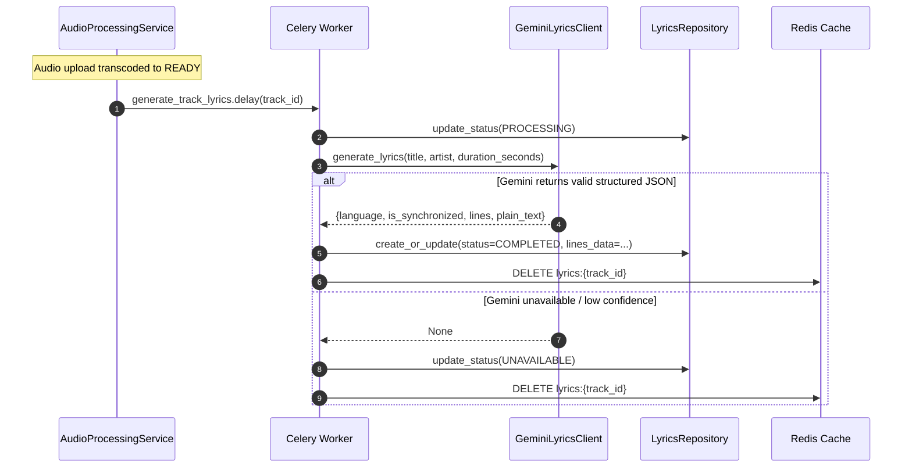

# AI Lyrics Generation Pipeline

## 1. Overview
The Hums AI Lyrics Pipeline generates accurate plain or synchronized lyrics using Google Gemini structured JSON schemas via asynchronous Celery background tasks.

## 2. Structured JSON Generation & Guardrails
The `GeminiLyricsClient` leverages Gemini's structured response capability (`response_mime_type="application/json"` and `response_schema=lyrics_schema`) with the following strict constraints:
- **Timestamp Accuracy**: Start timestamps must be monotonically increasing.
- **Duration Boundary Check**: Any timestamp beyond the track's duration is rejected.
- **Fallback Rule**: If timestamps fail validation or cannot be determined reliably, the pipeline produces plain text lyrics (`is_synchronized: false`) or marks the track as `UNAVAILABLE`. It **never** manufactures fabricated timestamps.

## 3. Celery Worker Integration
- **Task**: `app.workers.lyrics_tasks.generate_track_lyrics(track_id: str)`
- **Auto-Invocation**: Automatically triggered when a track completes transcoding (`TrackStatus.READY`).
- **Idempotency**: Safe to re-trigger multiple times via `POST /api/v1/tracks/{track_id}/lyrics/generate`.
