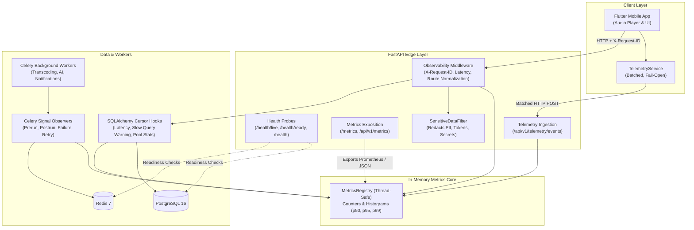
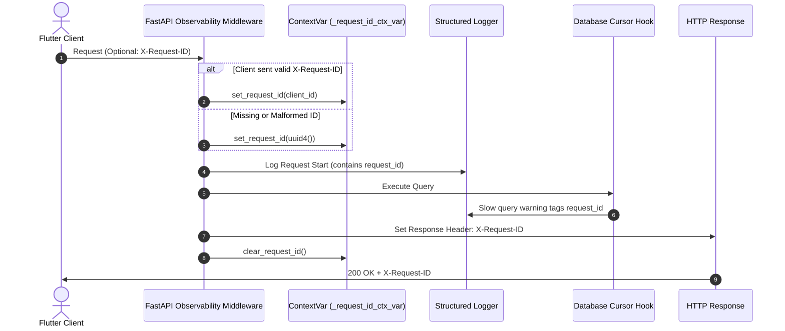

# Hums — Production Observability Architecture

This document specifies the technical design, data flows, components, and privacy controls of the production observability layer implemented for the Hums high-fidelity audio streaming platform.

---

## 1. High-Level Architecture Overview

Hums implements a lightweight, zero-external-dependency observability subsystem designed for high throughput, sub-millisecond overhead, and strict data privacy. It unifies logging, metrics, health checks, background job tracking, and mobile client telemetry into a coherent operational layer.



---

## 2. Core Architectural Principles

1. **Zero External Dependency Hardening**: The observability layer does not require third-party agents, daemon sidecars, or SaaS collectors to function. It uses an in-memory, thread-safe registry with standard Prometheus text exposition (`/metrics`).
2. **Fail-Open Isolation**: Telemetry collection, logging, and metrics recording must never interrupt user audio playback or cause API failures. All metric and telemetry hooks are defensively wrapped in exception traps.
3. **Strict Low-Cardinality Controls**: Prometheus label dimensions are strictly controlled. Endpoint routes use parameterized templates (`/api/v1/playlists/{playlist_id}`) rather than raw paths. High-cardinality identifiers (user IDs, track IDs, emails, query strings) are forbidden as metric labels.
4. **Data Privacy & Zero Secret Leaks**: All log messages pass through an active `SensitiveDataFilter` that sanitizes Authorization headers, JWTs, database connection strings, passwords, and presigned object storage signatures.

---

## 3. Request Correlation & Distributed Context

Every HTTP interaction across Hums is tagged with a unique correlation identifier:



- **Context Propagation**: Python's `contextvars.ContextVar` maintains the correlation ID across asynchronous ASGI tasks.
- **Sanitization**: Incoming request IDs are checked against `^[a-zA-Z0-9_\-]{8,64}$`. Malformed, pathological, or header-injection payloads are discarded and replaced with a fresh UUIDv4.
- **Client Visibility**: The ID is returned in the `X-Request-ID` HTTP response header, allowing mobile clients and developers to correlate client issues directly with server logs.

---

## 4. Structured Logging & Redaction Pipeline

Hums supports dual logging modes configured via the `LOG_FORMAT` environment variable:
- `auto`: Outputs clean colorized/text logs in development, and high-performance structured JSON in production (`APP_ENV=production`).
- `json`: Forces structured single-line JSON on standard output for aggregation by Vector, FluentBit, or CloudWatch.
- `text`: Forces human-readable text logs for local debugging.

### Sensitive Data Scrubbing
Every log record is evaluated by [`SensitiveDataFilter`](file:///Users/ronakjeengar/Desktop/hums/backend/app/core/logging.py#L22):
- **Bearer Tokens**: `Bearer [A-Za-z0-9\-_=]+\.[A-Za-z0-9\-_=]+\.[A-Za-z0-9\-_=]+` $\rightarrow$ `Bearer [REDACTED]`
- **Credentials & Passwords**: `"password": "..."` or `"token": "..."` $\rightarrow$ `"password": "[REDACTED]"`
- **Database URLs**: `postgresql(\+asyncpg)?://.*?:(.*?)@` $\rightarrow$ `postgresql://user:[REDACTED]@`
- **S3 / MinIO Signed URLs**: `(X-Amz-Signature|Signature)=[a-zA-Z0-9]+` $\rightarrow$ `$1=[REDACTED]`

---

## 5. In-Memory Metrics Registry & Latency Histograms

The [`MetricsRegistry`](file:///Users/ronakjeengar/Desktop/hums/backend/app/core/metrics.py#L93) provides atomic, thread-safe counters and sliding-window histograms:

### Metrics Catalog

| Metric Name | Type | Labels | Description |
| :--- | :--- | :--- | :--- |
| `hums_http_requests_total` | Counter | `method`, `endpoint`, `status_code` | Total processed HTTP requests |
| `hums_http_errors_total` | Counter | `method`, `endpoint`, `status_class`, `status_code` | Total HTTP 4xx/5xx responses |
| `hums_http_request_duration_seconds` | Summary | `method`, `endpoint`, `quantile` (0.5, 0.95, 0.99) | Request latency percentiles |
| `hums_db_queries_total` | Counter | `operation` (SELECT, INSERT, UPDATE, etc.) | Total database queries executed |
| `hums_db_slow_queries_total` | Counter | `operation` | Database queries exceeding `DB_SLOW_QUERY_MS` |
| `hums_db_query_duration_seconds` | Summary | `operation`, `quantile` | Database query execution latency |
| `hums_redis_cache_hits_total` | Counter | `cache_name` | Cache hit count |
| `hums_redis_cache_misses_total` | Counter | `cache_name` | Cache miss count |
| `hums_redis_errors_total` | Counter | `operation` | Failed Redis operations |
| `hums_celery_tasks_total` | Counter | `task`, `status` (started, success, failure, retry) | Background task executions |
| `hums_celery_task_duration_seconds` | Summary | `task`, `quantile` | Background task runtimes |
| `hums_audio_processing_success_total` | Counter | None | Completed audio transcode jobs |
| `hums_audio_processing_failure_total` | Counter | `category` (timeout, media_codec, storage, etc.) | Failed audio transcode jobs |
| `hums_ai_requests_total` | Counter | `task_type`, `status` | Gemini AI requests |
| `hums_ai_failures_total` | Counter | `task_type`, `category` | Gemini AI failures |
| `hums_notifications_sent_total` | Counter | None | Push notifications dispatched |
| `hums_notifications_failed_total` | Counter | None | Push notifications failed |
| `hums_playback_events_total` | Counter | `event_type`, `platform` | Mobile playback lifecycle events |
| `hums_playback_errors_total` | Counter | `category`, `platform` | Mobile playback error incidents |
| `hums_client_runtime_errors_total` | Counter | `error_type`, `platform` | Mobile UI non-fatal exceptions |

---

## 6. Health Probes & Orchestration

To prevent cascading restarts in container orchestrators (Kubernetes, Nomad, Docker Swarm), Hums strictly bifurcates liveness and readiness:

```text
               +-------------------------------------------------------+
               |                  Container Orchestrator               |
               +-------------------------------------------------------+
                              |                               |
                              v                               v
                  Periodic Liveness Probe         Periodic Readiness Probe
                  GET /health/live                GET /health/ready
                              |                               |
                              v                               v
                     Process Running?               Postgres & Redis OK?
                       +-- YES -> 200 Alive           +-- YES -> 200 Ready
                       +-- NO  -> 503 Terminate       +-- NO  -> 503 Remove from LB
```

1. **Liveness Probe (`/health/live`)**:
   - Shallow process check.
   - **Never** touches external network services or databases.
   - Always returns HTTP 200 as long as the Python event loop is scheduling tasks.
2. **Readiness Probe (`/health/ready`)**:
   - Deep dependency verification.
   - Checks PostgreSQL `SELECT 1` ping, Redis `PING`, Celery broker connectivity, and storage reachability.
   - If PostgreSQL or Redis fails, returns HTTP 503 `{"status": "degraded"}` so the load balancer stops routing traffic to the instance without killing the container.
3. **Deep System Health (`/api/v1/health`)**:
   - Administrative endpoint providing detailed status across all subsystems for dashboards and operations teams.

---

## 7. Database Observability

SQLAlchemy engine listeners hook directly into `before_cursor_execute` and `after_cursor_execute`:
- Measures exact database roundtrip time for every statement.
- Identifies queries exceeding `DB_SLOW_QUERY_MS` (default: 100ms).
- Logs statement summaries with stripped parameters (preventing credential leakage).
- Tracks connection pool metrics via `get_db_pool_status`:
  - `pool_size`: Allocated connection capacity.
  - `checked_out`: Connections actively holding a transaction.
  - `checked_in`: Idle pool connections available for immediate reuse.
  - `overflow`: Connections created beyond `pool_size`.

---

## 8. Celery & Asynchronous Worker Observability

Celery workers emit telemetry via standard signals attached at worker startup:
- `task_prerun`: Records task start time and increments `started` metric.
- `task_postrun`: Measures duration and increments state metric (`SUCCESS`, `REVOKED`, etc.).
- `task_failure`: Classifies exceptions into low-cardinality categories (`timeout`, `network_infrastructure`, `media_codec_error`, `storage_error`, `authorization_error`, `application_error`).
- `task_retry`: Tracks retry counts and reasons.
- `get_celery_queue_depth`: Measures Redis queue length (`LLEN celery`) to alert on worker starvation or queue backlogs.

---

## 9. Mobile Client Telemetry Pipeline

The Flutter mobile client utilizes a non-blocking, batched telemetry collector ([`TelemetryService`](file:///Users/ronakjeengar/Desktop/hums/mobile/lib/core/observability/telemetry_service.dart)):
- **Buffering & Batching**: Events are queued in memory and flushed periodically (every 30 seconds) or when the batch exceeds 20 items.
- **Fail-Open Delivery**: All HTTP network calls are wrapped in defensive try/catch blocks; network timeouts or HTTP 5xx errors from the telemetry collector never crash or freeze the app.
- **Platform Error Hooks**: Global unhandled framework exceptions are captured via `FlutterError.onError` and `PlatformDispatcher.onError` and ingested as non-fatal telemetry errors.
