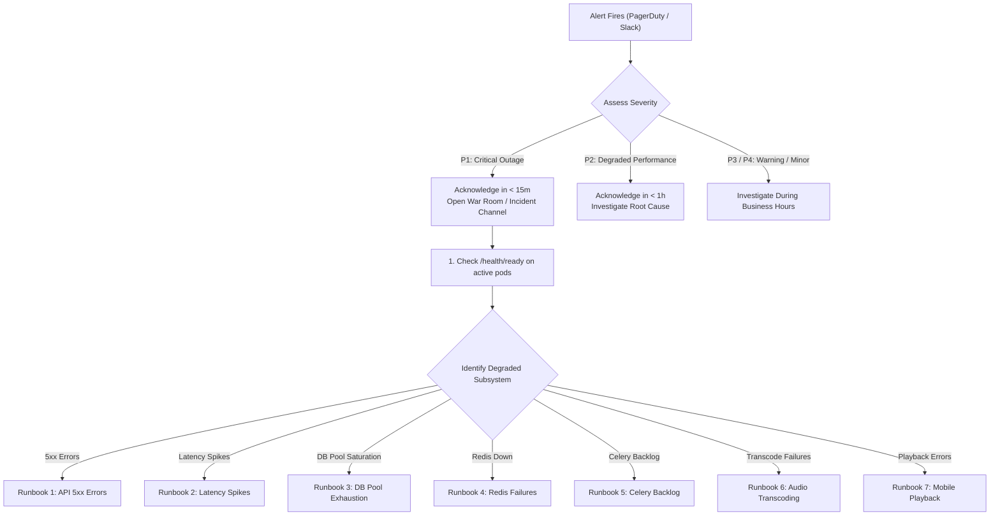

# Hums — Production Operations & Incident Response Runbook

This runbook provides actionable step-by-step procedures for on-call engineers diagnosing and resolving production alerts in Hums.

---

## 1. Incident Triage Workflow



---

## Runbook 1: Investigating High API 5xx Errors

### Symptoms
- Alert: `hums_http_errors_total{status_class="5xx"}` exceeding 1% of total traffic.
- Users report failure dialogs on login or browsing.

### Diagnostic Steps
1. **Identify the Failing Endpoints**:
   Query Prometheus for top failing routes:
   ```promql
   topk(5, sum by (endpoint, status_code) (rate(hums_http_errors_total{status_class="5xx"}[5m])))
   ```
2. **Correlate with Server Logs using Request ID**:
   Filter structured production JSON logs for error status:
   ```bash
   # On container log stream:
   docker logs hums-api --tail 500 | jq 'select(.level=="ERROR")'
   ```
   Note the `request_id` from failing requests.
3. **Trace the Specific Request**:
   ```bash
   docker logs hums-api | jq 'select(.request_id=="<REQUEST_ID>")'
   ```
4. **Identify Failure Cause**:
   - Database unreachable (`OperationalError`) $\rightarrow$ Proceed to Runbook 3.
   - Redis unreachable (`ConnectionError`) $\rightarrow$ Proceed to Runbook 4.
   - Unhandled exception in business logic $\rightarrow$ Verify recent deploy and initiate rollback if regression.

---

## Runbook 2: Investigating API Latency Spikes

### Symptoms
- Alert: `hums_http_request_duration_seconds{quantile="0.95"} > 0.50s`.

### Diagnostic Steps
1. **Find Slowest Routes**:
   ```promql
   topk(5, hums_http_request_duration_seconds{quantile="0.95"})
   ```
2. **Check Database Query Performance**:
   Look for slow query log entries:
   ```bash
   docker logs hums-api | jq 'select(.message | test("SLOW QUERY"))'
   ```
3. **Check Connection Pool Wait Times**:
   Inspect `/api/v1/metrics` or query `hums_db_pool_checked_out`. If pool is saturated, queries are waiting for available connections.
4. **Mitigation**:
   - If a specific endpoint is missing an index or making N+1 queries, add temporary query caching in Redis or scale API instances.

---

## Runbook 3: Investigating Database Pool Exhaustion

### Symptoms
- Alert: `hums_db_pool_checked_out / (pool_size + overflow) > 0.85`.
- Logs show `QueuePool limit of size X overflow Y reached, connection timed out`.

### Diagnostic Steps
1. **Check Active Database Connections**:
   Connect to PostgreSQL:
   ```sql
   SELECT pid, state, age(clock_timestamp(), query_start), query 
   FROM pg_stat_activity 
   WHERE state != 'idle' 
   ORDER BY query_start ASC;
   ```
2. **Identify Long-Running or Blocked Queries**:
   Look for queries holding locks:
   ```sql
   SELECT blocked_locks.pid AS blocked_pid,
          blocking_locks.pid AS blocking_pid,
          blocked_activity.query AS blocked_statement,
          blocking_activity.query AS current_statement_in_blocking_process
   FROM  pg_catalog.pg_locks blocked_locks
   JOIN pg_catalog.pg_stat_activity blocked_activity ON blocked_activity.pid = blocked_locks.pid
   JOIN pg_catalog.pg_locks blocking_locks 
       ON blocking_locks.locktype = blocked_locks.locktype
       AND blocking_locks.database IS NOT DISTINCT FROM blocked_locks.database
       AND blocking_locks.relation IS NOT DISTINCT FROM blocked_locks.relation
       AND blocking_locks.page IS NOT DISTINCT FROM blocked_locks.page
       AND blocking_locks.tuple IS NOT DISTINCT FROM blocked_locks.tuple
       AND blocking_locks.virtualxid IS NOT DISTINCT FROM blocked_locks.virtualxid
       AND blocking_locks.transactionid IS NOT DISTINCT FROM blocked_locks.transactionid
       AND blocking_locks.classid IS NOT DISTINCT FROM blocked_locks.classid
       AND blocking_locks.objid IS NOT DISTINCT FROM blocked_locks.objid
       AND blocking_locks.objsubid IS NOT DISTINCT FROM blocked_locks.objsubid
       AND blocking_locks.pid != blocked_locks.pid
   JOIN pg_catalog.pg_stat_activity blocking_activity ON blocking_activity.pid = blocking_locks.pid
   WHERE NOT blocked_locks.granted;
   ```
3. **Mitigation**:
   - Terminate stuck queries:
     ```sql
     SELECT pg_terminate_backend(<BLOCKING_PID>);
     ```
   - Scale connection pool limits in `backend/app/core/config.py` if genuine traffic surge exceeds `DB_POOL_SIZE`.

---

## Runbook 4: Investigating Redis Failures

### Symptoms
- `/health/ready` returns 503 with `"redis": "disconnected"`.
- Rate limiting or Celery dispatch fails.

### Diagnostic Steps
1. **Verify Redis Container & Memory**:
   ```bash
   docker ps | grep redis
   docker exec -it hums-redis redis-cli info memory
   ```
2. **Check Redis Ping**:
   ```bash
   docker exec -it hums-redis redis-cli ping
   ```
3. **Inspect Redis Maxmemory and Eviction Policy**:
   Verify `maxmemory_policy` is `allkeys-lru` or `volatile-lru`. If memory is 100% full, Redis may reject writes.
4. **Mitigation**:
   - If Redis is unresponsive, restart the container:
     ```bash
     docker restart hums-redis
     ```

---

## Runbook 5: Investigating Celery Worker Backlogs

### Symptoms
- Alert: `hums_celery_queue_depth > 100`.
- Uploads or AI tasks remain in pending status.

### Diagnostic Steps
1. **Check Worker Status**:
   ```bash
   docker exec -it hums-celery celery -A app.workers.celery_app inspect active
   ```
2. **Inspect Queue Depth**:
   ```bash
   docker exec -it hums-redis redis-cli llen celery
   ```
3. **Check for Stuck Worker Processes**:
   If a worker is stuck in FFmpeg transcoding or a synchronous network call without timeouts:
   ```bash
   docker logs hums-celery --tail 200
   ```
4. **Mitigation**:
   - Scale worker concurrency:
     ```bash
     docker compose up -d --scale celery_worker=3
     ```
   - Purge stale tasks if poisoned:
     ```bash
     docker exec -it hums-celery celery -A app.workers.celery_app purge
     ```

---

## Runbook 6: Investigating Audio Transcoding Failures

### Symptoms
- Alert: `hums_audio_processing_failure_total` spike.

### Diagnostic Steps
1. **Query Failure Categories**:
   ```promql
   sum by (category) (rate(hums_audio_processing_failure_total[15m]))
   ```
2. **Inspect Failure Details**:
   Filter worker logs for transcoding failures:
   ```bash
   docker logs hums-celery | grep -E "TASK_FAILURE.*process_audio_track"
   ```
3. **Common Root Causes**:
   - `media_codec_error`: User uploaded corrupt audio or unsupported container format. Check file validation in `test_audio_upload.py`.
   - `storage_error`: MinIO/S3 credentials expired or bucket full. Check storage reachability via `/health/ready`.
   - `timeout`: Audio file is excessively large (exceeding max transcode time limit).

---

## Runbook 7: Investigating Mobile Playback Failures

### Symptoms
- Alert: `hums_playback_errors_total` spike reported by Flutter mobile clients.

### Diagnostic Steps
1. **Analyze Error Categories**:
   Query Prometheus for client error categories:
   ```promql
   sum by (category, platform) (rate(hums_playback_errors_total[10m]))
   ```
2. **Check Categories**:
   - `buffer_underrun`: Network congestion or object storage CDN throughput degradation.
   - `http_403`: Expired MinIO presigned URL signature or clock skew.
   - `decoder_error`: Audio format incompatible with specific Android/iOS player decoders.
3. **Inspect Client Crash Reports**:
   Check `/api/v1/metrics` summary under `playback.client_errors` or logs for `Client runtime error`.

---

## 8. Graceful Restart & Rolling Deployment Procedures

### FastAPI Graceful Drain
FastAPI is managed by Uvicorn. To reload without dropping in-flight connections:
```bash
# Send SIGHUP to parent Uvicorn process for graceful reload:
kill -HUP $(pgrep -f "uvicorn.*app.main:app")
```

### Celery Warm Shutdown
Celery workers support warm shutdown (`SIGTERM`), waiting for active transcoding tasks to finish before terminating:
```bash
# Warm shutdown (waits for active tasks):
kill -TERM $(pgrep -f "celery.*worker")
```
*(Avoid `kill -9` which leaves tasks unacknowledged or half-transcoded in object storage).*
