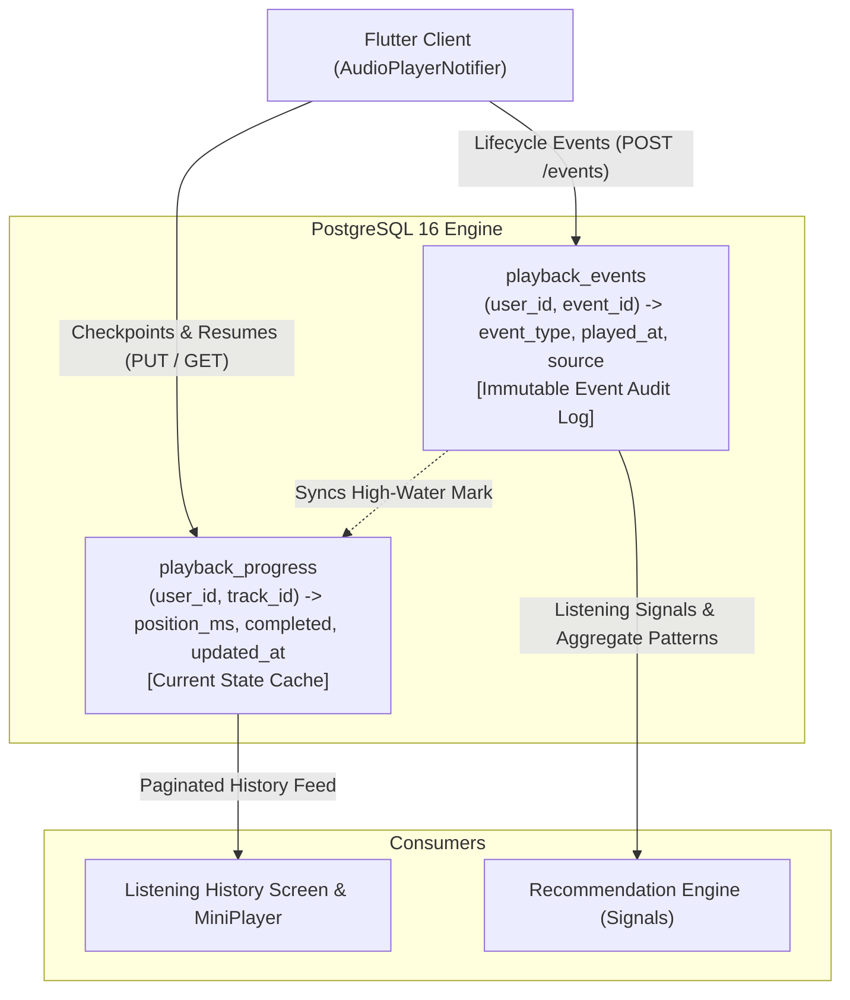

# HUMS — Listening History & Playback Progress Architecture

## 1. Overview & Architectural Goals

The **Listening History & Playback Progress Sync** subsystem provides a resilient, high-throughput, cross-device foundation for audio playback state management. It enables Hums users to:
* Seamlessly resume audio tracks from where they stopped on any device.
* Browse a chronologically organized "Recently Played" listening history feed.
* Persistently record playback lifecycle events without flooding the network or database.
* Continue listening completely offline, accumulating local events that auto-sync idempotently when connectivity returns.
* Expose high-fidelity listening signals to recommendation and discovery algorithms.

---

## 2. Separation of Concerns: Progress State vs. Event Stream

To optimize both read performance (fetching recently played tracks and resume markers) and analytical integrity (tracking listening history without duplicates), Hums separates playback data into two distinct database entities:

### 2.1 `playback_progress` (Current State Table)
* **Purpose:** Stores the single authoritative resume position and completion state for a given user and track.
* **Constraints:** Enforces `UNIQUE (user_id, track_id)` so each user has at most one record per track.
* **Indexing:** Composite B-tree index `(user_id, updated_at DESC)` enables instant pagination of the user's recently played list without table scans or runtime sorting.
* **Query Performance:** Joined with `tracks` using `joinedload` / `selectinload` to deliver track metadata in a single query with zero N+1 overhead.

### 2.2 `playback_events` (Immutable Audit Log)
* **Purpose:** Append-only log recording every discrete playback event (`PLAY_STARTED`, `PROGRESS_CHECKPOINT`, `PAUSED`, `RESUMED`, `SEEKED`, `SKIPPED`, `COMPLETED`, `STOPPED`).
* **Idempotency:** Enforces `UNIQUE (user_id, event_id)` where `event_id` is a client-generated UUID v4. Offline sync retries and network race conditions are gracefully absorbed with zero duplicate records or play count inflation.
* **Indexing:** Composite B-tree index `(user_id, played_at DESC)` and `(user_id, track_id)`.

---

## 3. Intelligent Progress Checkpointing (Anti-Spam Strategy)

A primary failure mode of naive audio apps is emitting HTTP requests or database writes on every audio position tick (e.g. every 200ms). In Hums:
1. **Local Player Stream:** The mobile audio player emits smooth position updates at 60fps to local UI state for slider and timer updates.
2. **Debounced Network Checkpoints:** Network checkpoints are strictly throttled:
   * **Periodic Heartbeat:** Exactly once every 15 seconds during active playback.
   * **State Transition Checkpoints:** Immediately on discrete player state changes (`PAUSED`, `SEEKED`, `SKIPPED`, `COMPLETED`, `STOPPED`).
   * **Lifecycle Checkpoint:** When the app transitions to background or inactive state (`didChangeAppLifecycleState`).

---

## 4. Recommendation Engine Integration

Instead of rebuilding a separate analytics pipeline, `PlaybackService` and `PlaybackRepository` expose clean aggregated listening signals (`RecommendationListeningSignal`):
* `play_count`: Total number of playback sessions initiated.
* `completion_count`: Total number of times the track was listened to completion (>=95%).
* `total_duration_listened_ms`: Cumulative audio exposure time.
* `last_played_at`: Recency timestamp for decay calculations.
* `completed`: Whether the user has finished the track.
