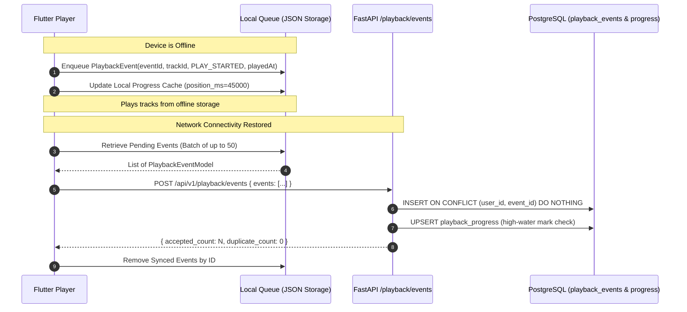

# HUMS — Playback Progress Synchronization & Offline Protocol

## 1. Cross-Device Synchronization Protocol

When a user switches between devices (e.g. mobile phone, tablet, desktop web):
1. **Track Load (`playTrack(trackId)`):**
   * The client fetches `GET /api/v1/playback/progress/{track_id}` (or reads from local cache if offline).
   * **Replay Rule:** If `completed == true` or `progress_percent >= 0.95`, playback begins at `Duration.zero` (0:00). A user replaying a song or podcast episode should never be resumed at the last 2 seconds.
   * **Resume Rule:** If the user previously listened to more than 3 seconds (`position_ms > 3000`) and the track is not completed, the audio player seeks to `position_ms` prior to playback start.
2. **Conflict Resolution (High-Water Mark):**
   * Checkpoints carry client timestamps (`played_at`).
   * On the server, `playback_progress.updated_at` guards against out-of-order writes: an incoming update is only applied to `playback_progress` if `played_at >= record.updated_at`. Stale checkpoints from a disconnected device cannot overwrite newer playback progress.

---

## 2. Offline Playback & Queue Synchronization Flow

### 2.1 Local Storage Layout & Atomic Writes
* Local event queues and progress caches are stored per user in isolated application documents directories:
  * `${appDocDir}/history/${userId}/offline_events.json`
  * `${appDocDir}/history/${userId}/offline_progress.json`
* Writes use an atomic temporary-file-and-rename pattern (`.tmp` -> rename) ensuring that sudden app kills or operating system shutdowns never corrupt the JSON store.

### 2.2 Offline Batch Chunking & Ingestion Limits
* Un-synced events are batched into chunks of up to 50 items.
* The backend enforces a strict ceiling of 100 events per batch request (`PlaybackBatchEventsRequest.max_length = 100`) to bound memory allocation and request execution times.
* The endpoint runs under an authorized rate limiter (`120 requests / 60 seconds`).
