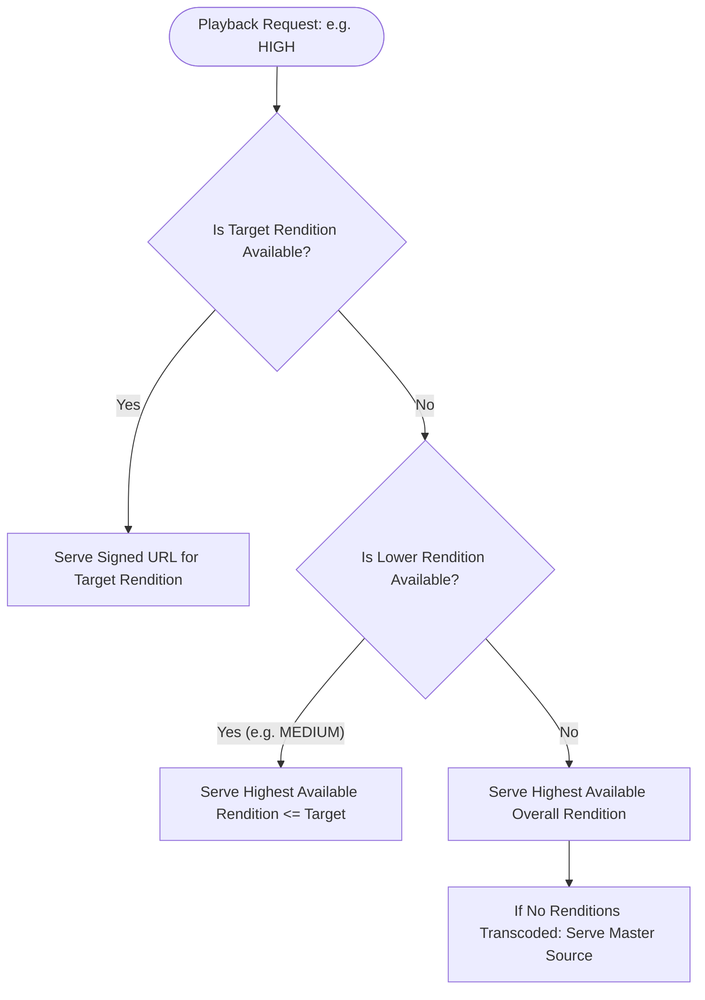

# Quality Fallback & Transcode Degradation Handling

## Overview

In an asynchronous transcoding pipeline, media files may occasionally be partially transcoded or certain renditions may still be processing. The Hums playback pipeline includes graceful degradation mechanisms to ensure playback never abruptly fails due to missing or delayed renditions.

---

## Degradation Strategy

### Backend Rendition Resolution Logic (`audio_service.py`)

1. **Exact Match**:
   * Evaluates if `rendition.bitrate_kbps == target_bitrate` exists and is marked as valid in database/storage.
   * If found, returns the signed URL directly.

2. **Downscale Fallback**:
   * If the requested tier (e.g. `HIGH` - 192k) is unavailable, it queries for the next highest available rendition that is less than or equal to the requested bitrate (e.g. `MEDIUM` - 128k).

3. **Upscale / Best-Available Fallback**:
   * If requested tier was `LOW` (64k) but only `MEDIUM` (128k) is transcoded, it selects the closest available rendition.

4. **Master File Fallback**:
   * If no transcoded renditions are yet available (e.g., track was just uploaded and background workers are still processing), the service falls back to the original audio file to guarantee immediate availability.

5. **Observability Recording**:
   * Whenever a fallback occurs, the backend increments `audio_quality_fallback_total{requested="...", served="..."}` to provide ops visibility into transcoding queues and latency.

---

## Offline Downloads vs. Live Streaming

* **Offline Independence**:
  * Download quality configurations determine the quality requested at download time (`/download?quality={tier}`).
  * Once downloaded and stored locally in encrypted application storage, changing download settings does **not** re-encode or invalidate existing downloaded files.
  * Offline playback operates strictly from local storage with zero network dependencies.
