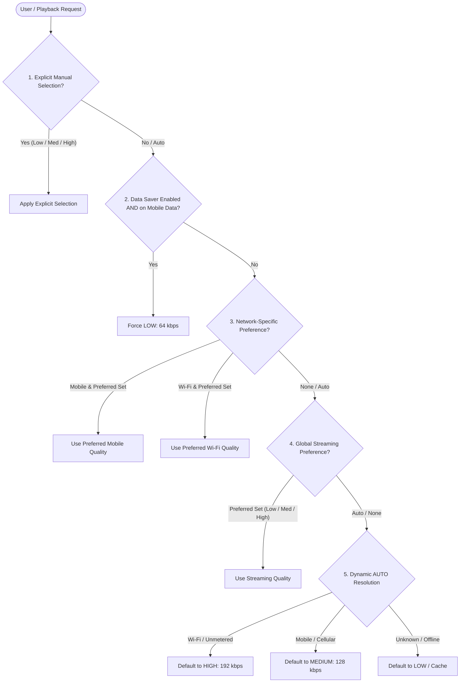

# Quality Selection & Resolution Precedence

## Overview

The Hums playback quality subsystem implements a deterministic, multi-tier decision hierarchy for choosing audio stream bitrates and download renditions. The decision logic is encapsulated in `PlaybackQualityResolver` on the Flutter client and `audio_service.py` on the FastAPI backend.

---

## Precedence Hierarchy (Section 19)

When determining the audio stream rendition to request from the CDN/backend, Hums resolves candidate qualities strictly according to the following order:

### Detailed Rules

1. **Manual / Explicit Session Selection**:
   * When a user taps the Audio Quality sheet (`AudioQualityBottomSheet`) in the player and selects a specific tier (`LOW`, `MEDIUM`, `HIGH`), this selection explicitly overrides all network rules and settings for that playback session.
   * Selecting `AUTO` in the sheet yields back control to the automatic decision engine.
   * Selecting a new tier triggers seamless on-the-fly rendition switching: the player fetches the new rendition's URL and continues playback from the exact position without interrupting the user.

2. **Data Saver Mode**:
   * If `dataSaverEnabled == true` and network connection is detected as cellular (`NetworkType.mobile`), the resolver unconditionally forces `LOW` (64 kbps).
   * Overrides user's configured preferred mobile quality or global streaming quality.
   * Does NOT force LOW on unmetered Wi-Fi connections.

3. **Network-Specific Preference**:
   * If on Wi-Fi: checks `preferredWifiQuality`. If not `AUTO`, applies it.
   * If on Mobile: checks `preferredMobileQuality`. If not `AUTO`, applies it.

4. **Global Streaming Preference**:
   * If network-specific preference is `AUTO`, evaluates `preferredStreamingQuality`. If configured to `LOW`, `MEDIUM`, or `HIGH`, applies it.

5. **Dynamic AUTO Resolution**:
   * When all relevant settings are `AUTO`:
     * Wi-Fi / Ethernet -> resolves to `HIGH` (192 kbps).
     * Mobile / Cellular -> resolves to `MEDIUM` (128 kbps).
     * Unknown / Offline -> resolves to `LOW` (64 kbps).

6. **Available Rendition Fallback**:
   * If the requested tier has not finished transcoding or is unavailable for a given track, the server gracefully falls back to the highest available rendition without failing playback.

---

## On-the-Fly Quality Switching

When the user switches quality during playback:
1. Current position is noted (`positionMs`).
2. Current playing state is preserved (`wasPlaying = state.isPlaying`).
3. Audio source is fetched for the target quality tier.
4. Player loads new rendition and seeks immediately to `positionMs`.
5. If `wasPlaying`, playback resumes seamlessly.
6. The UI badge updates dynamically (e.g., `HIGH · AAC 192 kbps`).
