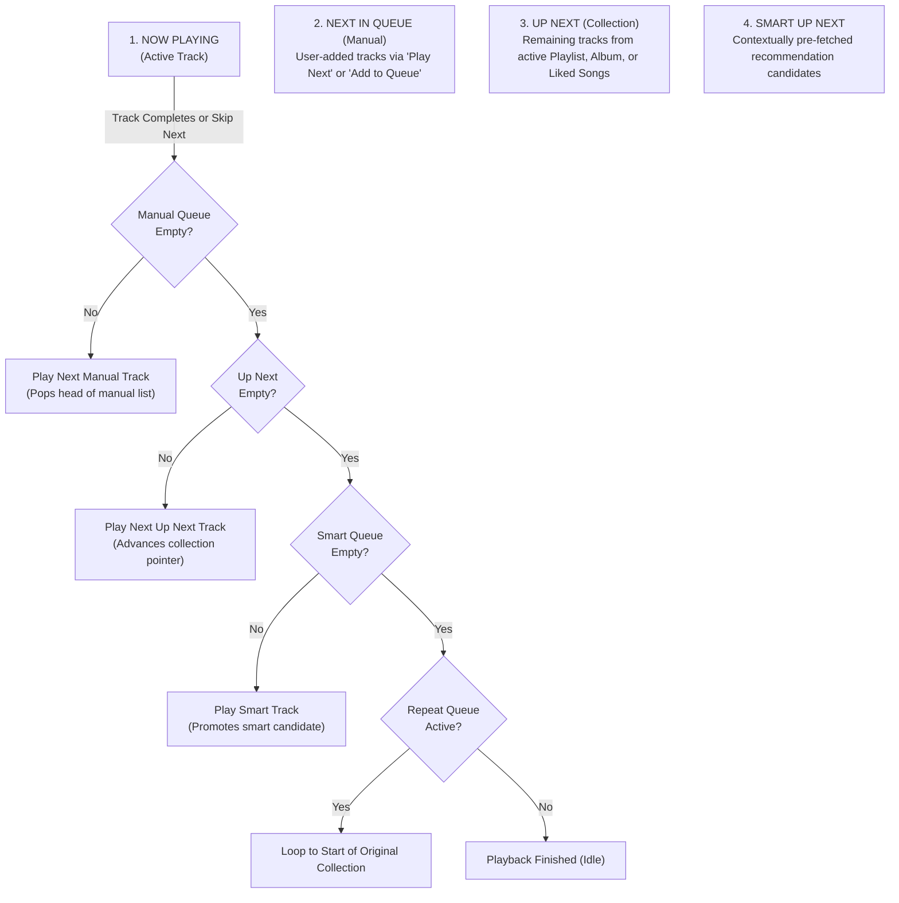
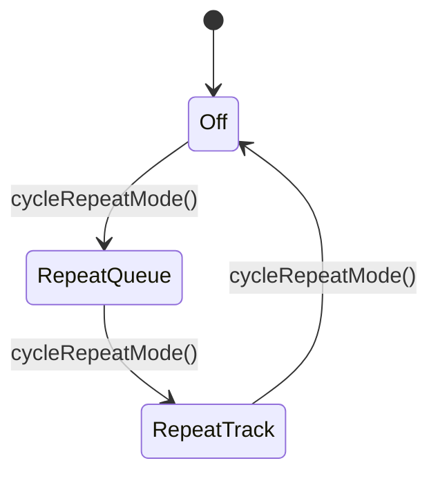

# HUMS — Queue & Up Next Architecture

## 1. Overview & Architectural Principles

The **Queue & Up Next** subsystem provides a responsive, gapless, multi-tiered playback queue architecture for Hums. It enables listeners to take complete control of their playback trajectory while ensuring continuous audio streaming when user-selected collections conclude.

### Core Architectural Tenets
1. **Client-Side Queue Authority:** The active playback queue is strictly managed as client-side reactive state within Riverpod (`AudioPlayerNotifier`). Queue mutations (reorders, additions, removals) never incur database writes or synchronous network roundtrips, eliminating latency and server write amplification.
2. **Three-Tier Queue Separation:** Up Next, Manual Queue, and Smart Queue are kept as distinct, independently inspectable collections.
3. **Deterministic Shuffle & Unshuffle:** Shuffling operates strictly on upcoming collection tracks without destroying or losing the original album or playlist sequence. Unshuffling instantly restores the pristine collection sequence.
4. **Resilient Session Isolation:** Logging out purges active, manual, and smart queues, preventing private listening data from leaking across accounts on shared mobile devices.

---

## 2. Queue Domain Model

Playback sequence resolution follows a strict hierarchy across four discrete domains:

### 2.1 The Four Queue Tiers
| Tier | Source | User Controls | Auto-Refilled |
| :--- | :--- | :--- | :--- |
| **Now Playing** | Current track | Play/Pause, Seek, Like | No |
| **Manual Queue** | User explicit actions ("Play next", "Add to queue") | Drag-and-drop reorder, Remove, Clear | No |
| **Up Next** | Contextual collection (Playlist, Album, Liked Songs) | Reorder, Remove, Shuffle | No |
| **Smart Queue** | `/api/v1/player/up-next` | Promote to Play Next, Remove | Yes (when $\le 2$ upcoming) |

---

## 3. Playback Controls State Machine

### 3.1 Repeat Mode
Repeat functionality is modeled as a 3-state cycle:

* **`PlaybackRepeatMode.off`:** Playback stops when all manual, up-next, and smart candidates are exhausted.
* **`PlaybackRepeatMode.repeatQueue`:** When the up-next list is exhausted, the player resets the collection to `originalUpNextItems` and loops continuously.
* **`PlaybackRepeatMode.repeatTrack`:** When the active track finishes, it seeks to `Duration.zero` and restarts immediately without advancing the queue.

### 3.2 Deterministic Shuffle
When the user toggles shuffle:
1. `isShuffled` is set to `true`.
2. The current `upNextItems` are archived in `originalUpNextItems`.
3. The remaining `upNextItems` are shuffled using a random seed.
4. When toggled off (`isShuffled == false`), `upNextItems` is restored from `originalUpNextItems`, filtering out any tracks that have already played.
5. The manual queue is **never** affected by shuffle, respecting user explicit intent.

---

## 4. Skip & History Management

* **`skipToNext()` Priority:**
  1. If `manualItems` has items, dequeue index 0 and play.
  2. Else if `upNextItems` has items, dequeue index 0 and play.
  3. Else if `smartItems` has items, dequeue index 0 and play.
  4. Else if `repeatMode == repeatQueue`, reset up-next to original items and loop.
  5. Else stop playback and transition to `PlayerStatus.idle`.
* **`skipToPrevious()` History Recovery:**
  1. If playback position $> 3$ seconds, restart current track from `00:00`.
  2. If position $\le 3$ seconds and `historyItems` is not empty, pop the last played track from history, re-queue the current track to the head of up-next, and play the historical track.

---

## 5. Security & Session Hygiene

Queue data contains implicit user behavioral telemetry. To maintain strict security:
* When a user logs out (`AuthNotifier` emits unauthenticated state), `AudioPlayerNotifier.resetQueueOnLogout()` is triggered synchronously.
* All active streams and checkpoint timers are stopped, the audio engine is halted via `stop()`, and `queue` is reset to `null`.
* No cached queue items persist across distinct user sessions on the client device.
