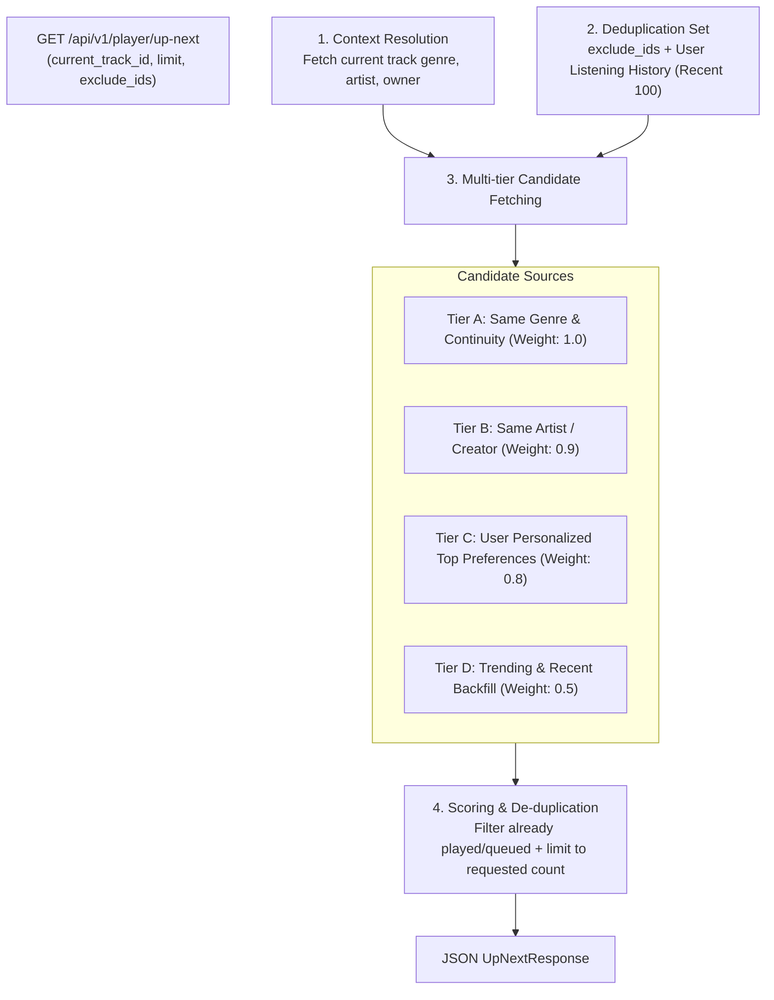
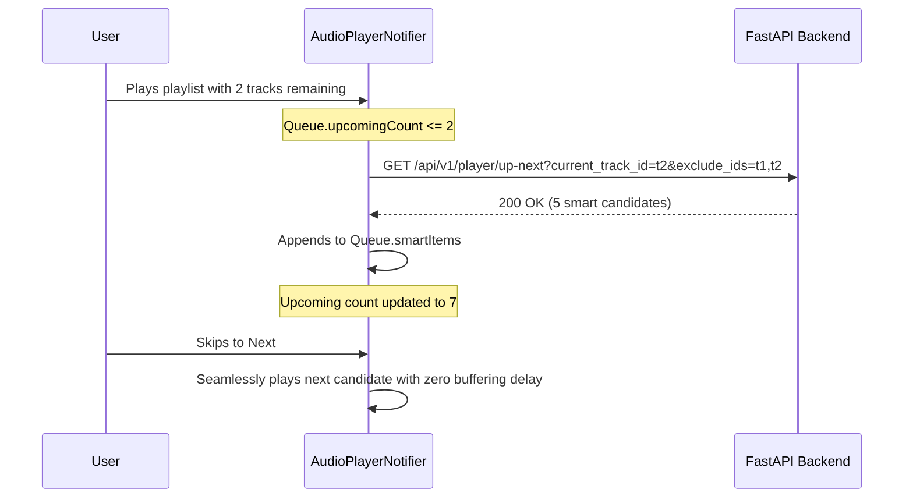

# HUMS — Smart Queue & Continuous Up Next Engine

## 1. Overview & Objectives

The **Smart Queue** engine prevents playback silence in Hums. When an active album, playlist, or manual queue approaches exhaustion, the smart queue pre-fetches context-aware candidates matching the listener's immediate taste, artist continuity, and acoustic profile.

---

## 2. Recommendation Candidate Pipeline

The candidate generation pipeline is implemented in `PlayerService` (`backend/app/services/player_service.py`) and is designed for sub-50ms execution:



### 2.1 Deduplication & Continuity Rules
1. **Direct Exclusions:** Any track IDs explicitly passed in `exclude_ids` (e.g. active track, queued items) are excluded via `track.id NOT IN (...)`.
2. **Listening History Filtering:** For authenticated users, recently played track IDs are queried from `playback_progress` and excluded to ensure fresh music discovery.
3. **Status Guard:** Only tracks with `status = 'READY'` are returned; incomplete, failed, or processing audio files are excluded.

---

## 3. Backend Endpoints

### 3.1 Get Smart Up-Next Candidates
* **Endpoint:** `GET /api/v1/player/up-next` (also aliased at `/api/v1/playback/queue/up-next`)
* **Auth:** Optional (`get_current_user_optional`). Anonymous users receive genre/trending fallback candidates.
* **Query Parameters:**
  * `current_track_id`: (optional) Seed track ID to maintain genre and style continuity.
  * `limit`: (optional, default 10, max 50) Number of candidates to return.
  * `exclude_ids`: (optional, comma-delimited) Track IDs already in the player queue.
* **Response (200 OK):**
```json
{
  "success": true,
  "data": {
    "items": [
      {
        "id": "3fa85f64-5717-4562-b3fc-2c963f66afa6",
        "title": "Acoustic Morning",
        "artist_name": "Luna Wave",
        "album_name": "Sunrise",
        "genre": "Acoustic",
        "duration_seconds": 185,
        "waveform_key": "waveforms/sample.json",
        "status": "READY",
        "source": "genre_match"
      }
    ],
    "count": 1
  }
}
```

### 3.2 Batch Track Resolution
* **Endpoint:** `GET /api/v1/player/resolve`
* **Query Parameters:** `track_ids` (comma-delimited list of UUIDs)
* **Response (200 OK):** Resolves full playable track metadata for arbitrary track IDs in a single batch query.

---

## 4. Mobile Client Pre-fetching Lifecycle



### Prefetching Invariants
* **Non-blocking Background Task:** Smart queue prefetching runs using `unawaited(_prefetchSmartQueue())`. Audio playback is never paused or interrupted by network latency.
* **Prefetch Debounce & Guard:** A `_prefetching` boolean guard ensures that at most one prefetch request is in flight at any given time.
* **Cancellation on State Reset:** When playback stops or queue clears, in-flight prefetch requests are safely cancelled via `CancelToken`.
