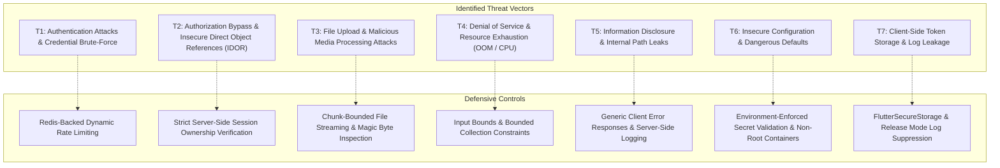

# Hums — Production Security Baseline & Threat Model

**Document Version:** 1.0.0  
**Status:** Approved Security Baseline  
**Date:** 2026-09-24  
**Scope:** Full Application Stack (Flutter Mobile, FastAPI Backend, PostgreSQL 16, Redis 7, Celery Workers, FFmpeg Engine, Object Storage / MinIO, Authentication & Session Rotation)  

---

## 1. Executive Summary

This document establishes the security baseline and threat model for the **Hums** audio streaming and podcast platform. It inventories critical assets, analyzes the threat landscape across all application boundaries, and details the baseline posture of authentication, authorization, data handling, and infrastructure prior to production hardening.

---

## 2. Protected Assets Inventory

The Hums platform processes and stores the following critical assets:

| Asset Category | Asset Description | Sensitivity | Authoritative Storage |
| :--- | :--- | :--- | :--- |
| **User Identities & Credentials** | Email addresses, usernames, bcrypt password hashes | **High / Critical** | PostgreSQL (`users`) |
| **Authentication Sessions** | JWT Access Tokens (HS256 short-lived, 30m) | **High** | Client Memory / Encrypted Keychain |
| **Session Rotation Tokens** | SHA-256 hashed refresh tokens (7-day validity) | **Critical** | PostgreSQL (`refresh_tokens`), Client SecureStorage |
| **Account Recovery Tokens** | Cryptographically random single-use reset tokens | **Critical** | PostgreSQL (`password_reset_tokens`) |
| **User Profile Metadata** | Full name, bio, avatar URLs, verification status | **Medium** | PostgreSQL (`users`), S3 (`avatars/`) |
| **Audio Catalog & Media** | Original audio masters, transcoded AAC/M4A renditions | **High** | S3 / MinIO (`audio/original/`, `audio/processed/`) |
| **Acoustic Waveforms** | Normalized 200-point amplitude JSON arrays | **Low / Medium** | S3 / MinIO (`audio/waveforms/`) |
| **User Playlists** | Custom playlist collections, tracks, and artwork | **Medium** | PostgreSQL (`playlists`, `playlist_tracks`), S3 (`playlists/`) |
| **Infrastructure Secrets** | Database passwords, Redis URLs, S3 access/secret keys | **Critical** | Server Environment Variables (`.env`) |
| **AI Credentials** | Google Gemini API Key (`GEMINI_API_KEY`) | **Critical** | Server Environment Variables only |
| **Worker Queue Tasks** | Celery transcode and waveform job messages | **Medium** | Redis DB 1 (Broker), Redis DB 2 (Results) |

---

## 3. Threat Model & Risk Taxonomy

Based on the architecture and data flows of Hums, the threat model evaluates risks across the following threat categories:

### Threat Breakdown:

1. **Authentication Attacks (T1):**
   * *Threat:* Repeated automated login attempts, credential stuffing, password spray, or mass account creation.
   * *Baseline Status:* Passwords are safely hashed with bcrypt (`gensalt()` + `hashpw()`), and tokens are validated with HS256. However, endpoints currently lack rate limiting, leaving `/auth/login` susceptible to brute-force attacks.

2. **Authorization & IDOR (T2):**
   * *Threat:* User A accesses, updates, or deletes User B's playlists, tracks, or profile.
   * *Baseline Status:* Strong server-side checks exist in `AudioService` (`get_by_id_and_owner`) and `PlaylistService` (`_verify_ownership`). Track IDs cannot be spoofed by modifying JWT claims. Minor edge cases exist (e.g. adding non-ready tracks to playlists, or calling logout without body).

3. **File Upload Attacks & Malicious Media (T3):**
   * *Threat:* Path traversal in filenames, polyglot executable uploads, or command injection via FFmpeg.
   * *Baseline Status:* FFmpeg is invoked strictly using argument lists (`subprocess.run(cmd)` with list of strings, zero `shell=True`). Uploaded filenames are sanitized with `os.path.basename` and never used for object keys (UUID-based deterministic paths are used). Magic bytes are verified (`ID3`, `RIFF`, `fLaC`, `OggS`, `ftyp`).

4. **Resource Exhaustion & DoS (T4):**
   * *Threat:* Uploading oversized payloads, submitting unbounded string sizes, or submitting massive track lists.
   * *Baseline Status:* Currently, `/audio/upload`, `/playlists/{id}/cover`, and `/profile/avatar` call `file.read()`, which reads the entire file into memory before size validation. Bounded chunk streaming is required to prevent memory exhaustion.

5. **Information Disclosure (T5):**
   * *Threat:* Stack traces, internal filesystem paths, or database errors leaked in API error responses.
   * *Baseline Status:* Centralized exception handlers catch unhandled exceptions and return generic `INTERNAL_SERVER_ERROR`. However, `dependencies.py` leaks internal `{str(exc)}` on invalid tokens, and production FastAPI exposes interactive `/docs` and `/openapi.json`.

6. **Insecure Configuration & Dangerous Defaults (T6):**
   * *Threat:* Deploying to production with default development `SECRET_KEY`, `DEBUG=True`, or wildcard CORS.
   * *Baseline Status:* `Settings` does not assert that production secrets differ from development defaults. Dockerfile runs as `root`.

7. **Client-Side Storage & Logging (T7):**
   * *Threat:* Storing JWTs in plaintext or logging sensitive headers/tokens to device logs.
   * *Baseline Status:* `FlutterSecureStorage` is used correctly on mobile. However, `LoggingInterceptor` runs unconditionally in release mode.

---

## 4. Initial Audit Findings Matrix

| Ref # | Category | Severity | Component | Finding Description |
| :--- | :--- | :--- | :--- | :--- |
| **SEC-01** | Rate Limiting | **High** | `app.api.v1.endpoints.auth` | No rate limiting on `/auth/login`, `/auth/register`, `/auth/forgot-password`. Vulnerable to brute-force and spam. |
| **SEC-02** | DoS / Memory | **High** | `app.api.v1.endpoints.audio`, `profile`, `playlists` | Unbounded `file.read()` reads complete uploaded payload into RAM before checking size limit. |
| **SEC-03** | Config / Secrets | **High** | `app.core.config` | Production configuration allows default insecure `SECRET_KEY`, `DEBUG=True`, or wildcard `CORS_ORIGINS`. |
| **SEC-04** | Security Headers | **Medium** | `app.main` | Missing standard security headers (`X-Content-Type-Options`, `X-Frame-Options`, `Strict-Transport-Security`, `Referrer-Policy`). |
| **SEC-05** | Reconnaissance | **Medium** | `app.main` | Interactive OpenAPI documentation (`/docs`, `/redoc`, `/openapi.json`) exposed unconditionally in production. |
| **SEC-06** | Input Validation | **Medium** | `app.schemas.user`, `audio`, `playlist` | Missing upper bounds on passwords in `UserLogin`, metadata fields in `upload_audio`, and reorder track lists. |
| **SEC-07** | Authorization | **Medium** | `app.services.playlist_service` | `add_track` allows adding non-ready (`FAILED`/`PROCESSING`) tracks to playlist queues. |
| **SEC-08** | Authentication | **Medium** | `app.api.v1.endpoints.auth` | Calling `/auth/logout` with Bearer token but no body executes a no-op instead of revoking current session. |
| **SEC-09** | Error Leakage | **Low** | `app.core.dependencies` | `get_current_user` leaks raw `str(exc)` in 401 error message when token validation fails; missing typing imports. |
| **SEC-10** | Container Security| **Low** | `backend/Dockerfile` | Application container runs as `root` without a dedicated least-privilege user. |
| **SEC-11** | Mobile Logging | **Low** | `mobile/lib/core/network` | `LoggingInterceptor` logs network traffic to system developer log even in Flutter release builds. |

---

## 5. Security Remediation Roadmap

1. Implement Redis-backed atomic rate limiter with per-endpoint configurations and graceful degradation.
2. Implement bounded chunk streaming (`read_upload_file_bounded`) for all audio, avatar, and cover upload paths.
3. Enforce strict configuration validation on startup when `APP_ENV == "production"`.
4. Add production security headers middleware and disable OpenAPI docs in production.
5. Apply length constraints and sanitize string inputs across Pydantic schemas.
6. Validate track `status == 'READY'` prior to playlist association.
7. Support session revocation on Bearer-only `/auth/logout` calls.
8. Fix typing annotations and sanitize error responses in `dependencies.py`.
9. Add non-root `appuser` to `Dockerfile`.
10. Disable Flutter network logging in release mode.
11. Add automated security regression tests verifying defensive controls.
