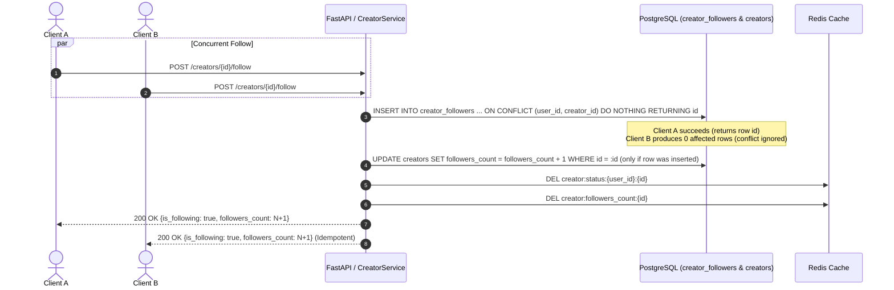

# Follow System & Concurrency Architecture

## 1. Relational Schema & Integrity Constraints

The relationship between users and creators is governed by the `creator_followers` table:

```sql
CREATE TABLE creator_followers (
    id UUID PRIMARY KEY DEFAULT gen_random_uuid(),
    user_id UUID NOT NULL REFERENCES users(id) ON DELETE CASCADE,
    creator_id UUID NOT NULL REFERENCES creators(id) ON DELETE CASCADE,
    created_at TIMESTAMPTZ NOT NULL DEFAULT NOW(),
    CONSTRAINT uq_creator_followers_user_creator UNIQUE (user_id, creator_id)
);

CREATE INDEX ix_creator_followers_creator_created ON creator_followers (creator_id, created_at DESC);
CREATE INDEX ix_creator_followers_user_created ON creator_followers (user_id, created_at DESC);
```

### Constraints & Indexes
1. **`uq_creator_followers_user_creator`:** Prevents duplicate follows at the database level.
2. **`ix_creator_followers_creator_created`:** Optimizes paginated follower retrieval (`GET /api/v1/creators/{id}/followers`).
3. **`ix_creator_followers_user_created`:** Optimizes user following retrieval (`GET /api/v1/users/me/following`).

---

## 2. High-Concurrency Follow / Unfollow Lifecycle

### 2.1 Concurrent Follow Execution
When multiple concurrent requests attempt to follow the same creator:



### 2.2 Atomic Non-Negative Unfollow
Unfollow operations use conditional deletion and bounded decrement:

```sql
-- Step 1: Delete follower record
DELETE FROM creator_followers
WHERE user_id = :user_id AND creator_id = :creator_id
RETURNING id;

-- Step 2: Decrement only if row was deleted, bounded by 0
UPDATE creators
SET followers_count = GREATEST(0, followers_count - 1),
    updated_at = NOW()
WHERE id = :creator_id
RETURNING followers_count;
```

This guarantees:
* Unfollowing an already unfollowed creator is idempotent and safe.
* Counters can never become negative under concurrent retry scenarios.
* Double-decrements and race conditions are eliminated.

---

## 3. Optimistic UI Updates & Client Rollback

The mobile client (`FollowNotifier`) provides an immediate responsive user experience through optimistic updates backed by rollback handlers:

```dart
Future<void> toggleFollow() async {
  if (state.isLoading) return;

  final previousState = state;
  final willFollow = !state.isFollowing;
  final newCount = willFollow
      ? state.followersCount + 1
      : (state.followersCount > 0 ? state.followersCount - 1 : 0);

  // 1. Optimistic transition
  state = state.copyWith(
    isFollowing: willFollow,
    followersCount: newCount,
    isLoading: true,
    errorMessage: null,
  );

  try {
    // 2. Authoritative backend synchronization
    final status = willFollow
        ? await _repository.followCreator(_creatorId)
        : await _repository.unfollowCreator(_creatorId);

    state = state.copyWith(
      isFollowing: status.isFollowing,
      followersCount: status.followersCount,
      isLoading: false,
    );
  } catch (e) {
    // 3. Rollback on failure
    state = previousState.copyWith(
      isLoading: false,
      errorMessage: 'Failed to update follow status. Please try again.',
    );
  }
}
```
