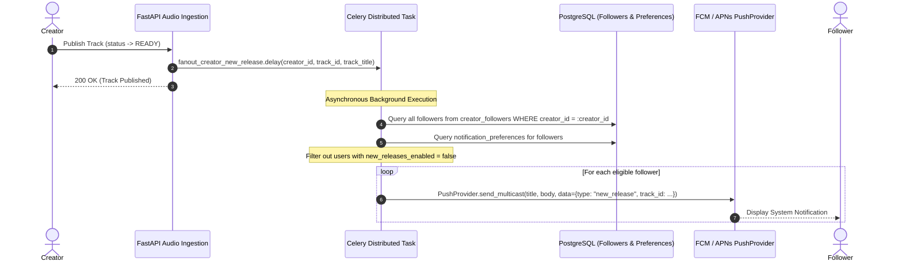

# Asynchronous Notification Fan-Out for Creator Activity

## 1. Fan-Out Pipeline

When a creator releases a new track or public content, notification dispatch is executed strictly outside the FastAPI request-response lifecycle using Celery distributed tasks.



---

## 2. Preference Enforcement & User Privacy

Before dispatching a push notification, the worker queries `notification_preferences` for each follower:
* If `new_releases_enabled == False`, the user is silently omitted from the fan-out batch.
* Stale or invalid device tokens returned by `PushProvider` are automatically deactivated in `user_devices`.
* Rate limiting and batch chunking (default chunk size: 500 followers) prevent worker memory starvation during high-follower artist releases.

---

## 3. Deep Linking & Mobile Handling

Push notifications payload schema:

```json
{
  "title": "New Release from Arijit Singh",
  "body": "Listen to 'Kesariya' now on Hums.",
  "data": {
    "type": "new_release",
    "track_id": "9b1deb4d-3b7d-4bad-9bdd-2b0d7b3dcb6d",
    "creator_id": "c7a8b9c0-1234-5678-9abc-def012345678",
    "click_action": "FLUTTER_NOTIFICATION_CLICK"
  }
}
```

When tapped by the user, the Flutter notification handler routes directly to:
* The track in the global audio player: `audioPlayerNotifierProvider.playTrack(trackId)`
* Or the creator profile: `/creators/:id`
