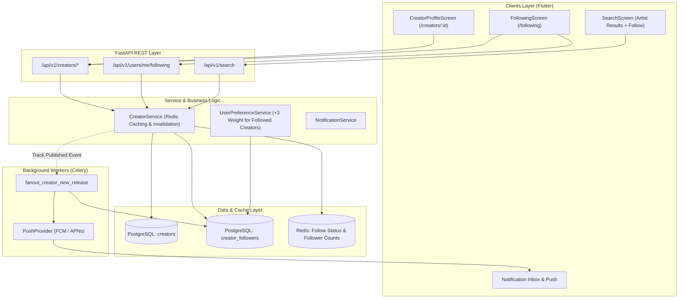

# Social Architecture & Creator Discovery

## 1. Architectural Overview

The **Social Profiles, Following & Creator Discovery** subsystem in **Hums** establishes an autonomous relationship layer between users and audio creators/artists. It decouples general listener identities from public creator entities, enforces high-concurrency follow/unfollow dynamics, provides rich public creator discographies, and injects social following signals across search, recommendations, and real-time release notifications.

---

## 2. Core Pillars

### 2.1 Identity Separation (Users vs. Creators)
* **Users (`users` table):** Private listener account containing authentication credentials, password hashes, email, device tokens, and private listening history.
* **Creators (`creators` table):** Public artist entity containing display name, unique username/slug, biography, avatar URL, cover image URL, verification flag, and authoritative follower count.
* **Security & Privacy Boundary:** Creator endpoints NEVER serialize private user fields. Endpoints returning follower lists serialize only `FollowerUserItem` containing public display names and avatars.

### 2.2 Server-Authoritative State & Caching
* **Atomic Non-Negative Counters:** PostgreSQL transaction updates `followers_count = GREATEST(0, followers_count +/- 1)` to prevent counter drift or negative values under high concurrency.
* **Redis Caching Strategy:**
  - `creator:status:{user_id}:{creator_id}`: Follow boolean cached for 1 hour.
  - `creator:followers_count:{creator_id}`: Total count cached for 1 hour.
  - Explicit multi-key invalidation upon `follow_creator` and `unfollow_creator`.
* **Zero N+1 Network & Database Queries:**
  - Batch lookup method `is_following_batch(user_id, creator_ids)` resolves follow statuses in a single `ANY(:creator_ids)` SQL query for search results and list views.

### 2.3 Cross-System Integrations
* **Search & Discovery:** Artist search directly targets the `creators` table, resolving `is_following` and `followers_count` for each artist in a single query.
* **AI Recommendations:** `UserPreferenceService` scores tracks by followed creators with an explicit `+3.0` weight boost, prioritizing releases from artists the user actively follows.
* **Release Notifications:** Celery background task `fanout_creator_new_release` iterates over followers, checks user notification preferences (`new_releases_enabled`), and dispatches push notifications asynchronously.
* **Global Audio Playback:** The `CreatorProfileScreen` enables instant 1-tap playback of popular tracks, constructing a `PlayerQueue` and driving `audioPlayerNotifierProvider.playQueue()`.
