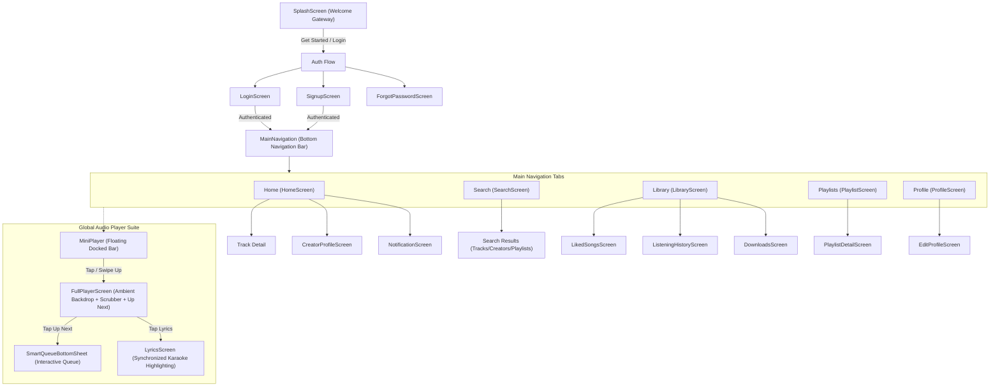

# Hums Screen Map & Navigation Hierarchy

---

## Screen Inventory & Paths

1. **Auth & Onboarding:**
   - `mobile/lib/features/common/presentation/screens/splash_screen.dart` (Welcome Gateway)
   - `mobile/lib/features/auth/presentation/screens/login_screen.dart`
   - `mobile/lib/features/auth/presentation/screens/signup_screen.dart`
   - `mobile/lib/features/auth/presentation/screens/forgot_password_screen.dart`

2. **Main Shell & Tabs:**
   - `mobile/lib/features/common/presentation/screens/home_screen.dart` (Home tab + bottom navigation shell)
   - `mobile/lib/features/search/presentation/screens/search_screen.dart` (Search tab)
   - `mobile/lib/features/library/presentation/screens/library_screen.dart` (Library tab)
   - `mobile/lib/features/playlists/presentation/screens/playlist_screen.dart` (Playlists tab)
   - `mobile/lib/features/profile/presentation/screens/profile_screen.dart` (Profile tab)

3. **Sub-screens & Details:**
   - `mobile/lib/features/playlists/presentation/screens/playlist_detail_screen.dart`
   - `mobile/lib/features/social/presentation/screens/creator_profile_screen.dart`
   - `mobile/lib/features/library/presentation/screens/liked_songs_screen.dart`
   - `mobile/lib/features/history/presentation/screens/listening_history_screen.dart`
   - `mobile/lib/features/downloads/presentation/screens/downloads_screen.dart`
   - `mobile/lib/features/notifications/presentation/screens/notification_screen.dart`
   - `mobile/lib/features/profile/presentation/screens/edit_profile_screen.dart`

4. **Global Player Suite:**
   - `mobile/lib/features/player/presentation/widgets/mini_player.dart`
   - `mobile/lib/features/player/presentation/screens/full_player_screen.dart`
   - `mobile/lib/features/player/presentation/widgets/smart_queue_sheet.dart`
   - `mobile/lib/features/lyrics/presentation/screens/lyrics_screen.dart`
